## Liste des objets dans Pokémon Noir et Blanc

# Baies

Les baies peuvent toutes être utilisées pour confectionner des plats (entrée, plat de résistance, dessert, boissons et autres).

Si vous faites ainsi et que les baies utilisées ont un effet (ex : restaure 10PV) votre plat aura les mêmes effets mais atténués (ex: 2PV à tous les Pokemon mangeant le plat préparé).

# Baies de soin

<table>
<colgroup>
<col style="width: 7%" />
<col style="width: 18%" />
<col style="width: 65%" />
<col style="width: 8%" />
</colgroup>
<thead>
<tr>
<th colspan="2" style="text-align: center;">Baie</th>
<th>Effet</th>
<th>Prix</th>
</tr>
</thead>
<tbody>
<tr>
<td style="text-align: center;">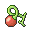</td>
<td>Baie Ceriz</td>
<td>Soigne la paralysie</td>
<td>50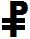</td>
</tr>
<tr>
<td style="text-align: center;">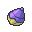</td>
<td>Baie Maron</td>
<td>Soigne le sommeil</td>
<td>50</td>
</tr>
<tr>
<td style="text-align: center;">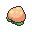</td>
<td>Baie Pêcha</td>
<td>Soigne l'empoisonnement</td>
<td>50</td>
</tr>
<tr>
<td style="text-align: center;">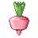</td>
<td>Baie Drash</td>
<td>Soigne l'empoisonnement</td>
<td>50</td>
</tr>
<tr>
<td style="text-align: center;">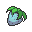</td>
<td>Baie Fraive</td>
<td>Soigne la brûlure</td>
<td>50</td>
</tr>
<tr>
<td style="text-align: center;">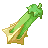</td>
<td>Baie Kuo</td>
<td>Soigne la brûlure</td>
<td>50</td>
</tr>
<tr>
<td style="text-align: center;">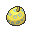</td>
<td>Baie Willia</td>
<td>Soigne le gel</td>
<td>50</td>
</tr>
<tr>
<td style="text-align: center;">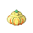</td>
<td>Baie Pumkin</td>
<td>Soigne le gel</td>
<td>50</td>
</tr>
<tr>
<td style="text-align: center;">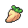</td>
<td>Baie Kika</td>
<td>Soigne la confusion</td>
<td>50</td>
</tr>
<tr>
<td style="text-align: center;"></td>
<td>Baie Touga</td>
<td>Soigne la confusion</td>
<td>50</td>
</tr>
<tr>
<td style="text-align: center;">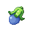</td>
<td>Baie Eggant</td>
<td>Soigne l'Attraction</td>
<td>50</td>
</tr>
<tr>
<td style="text-align: center;">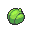</td>
<td>Baie Prine</td>
<td>Soigne tout changement de statut</td>
<td>150</td>
</tr>
<tr>
<td style="text-align: center;">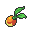</td>
<td>Baie Mepo</td>
<td>Restaure 10 PP</td>
<td>50</td>
</tr>
<tr>
<td style="text-align: center;">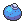</td>
<td>Baie Oran</td>
<td>Restaure 10 PV</td>
<td>50</td>
</tr>
<tr>
<td style="text-align: center;">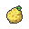</td>
<td>Baie Sitrus</td>
<td>Restaure 20 PV max</td>
<td>150</td>
</tr>
<tr>
<td style="text-align: center;">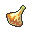</td>
<td>Baie Figuy</td>
<td>Restaure 1/8è des PV max, rend confus un Pokémon n'appréciant pas les Baies épicées</td>
<td>100</td>
</tr>
<tr>
<td style="text-align: center;">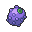</td>
<td>Baie Wiki</td>
<td>Restaure 1/8è des PV max, rend confus un Pokémon n'appréciant pas les Baies sèches</td>
<td>100</td>
</tr>
<tr>
<td style="text-align: center;">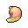</td>
<td>Baie Mago</td>
<td>Restaure 1/8è des PV max, rend confus un Pokémon n'appréciant pas les Baies sucrées</td>
<td>100</td>
</tr>
<tr>
<td style="text-align: center;">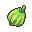</td>
<td>Baie Gowav</td>
<td>Restaure 1/8è des PV max, rend confus un Pokémon n'appréciant pas les Baies amères</td>
<td>100</td>
</tr>
<tr>
<td style="text-align: center;">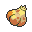</td>
<td>Baie Papaya</td>
<td>Restaure 1/8è des PV max, rend confus un Pokémon n'appréciant pas les Baies acides</td>
<td>100</td>
</tr>
</tbody>
</table>

# Baies de résistance obtenable uniquement à l’achat dans un champ de baie spécialisé

<table>
<colgroup>
<col style="width: 7%" />
<col style="width: 18%" />
<col style="width: 65%" />
<col style="width: 8%" />
</colgroup>
<thead>
<tr>
<th colspan="2" style="text-align: center;">Baie</th>
<th>Effet</th>
<th>Prix</th>
</tr>
</thead>
<tbody>
<tr>
<td style="text-align: center;"></td>
<td>Baie Pocpoc</td>
<td>Divise par 2 les dégâts occasionnés par une attaque de type eau super efficace</td>
<td>500</td>
</tr>
<tr>
<td style="text-align: center;">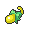</td>
<td>Baie Parma</td>
<td>Divise par 2 les dégâts occasionnés par une attaque de type électrique super efficace</td>
<td>500</td>
</tr>
<tr>
<td style="text-align: center;">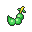</td>
<td>Baie Ratam</td>
<td>Divise par 2 les dégâts occasionnés par une attaque de type plante super efficace</td>
<td>500</td>
</tr>
<tr>
<td style="text-align: center;">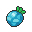</td>
<td>Baie Nanone</td>
<td>Divise par 2 les dégâts occasionnés par une attaque de type glace super efficace</td>
<td>500</td>
</tr>
<tr>
<td style="text-align: center;">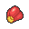</td>
<td>Baie Pomroz</td>
<td>Divise par 2 les dégâts occasionnés par une attaque de type Combat super efficace</td>
<td>500</td>
</tr>
<tr>
<td style="text-align: center;">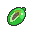</td>
<td>Baie Kébia</td>
<td>Divise par 2 les dégâts occasionnés par une attaque de type poison super efficace</td>
<td>500</td>
</tr>
<tr>
<td style="text-align: center;">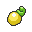</td>
<td>Baie Jouca</td>
<td>Divise par 2 les dégâts occasionnés par une attaque de type sol super efficace</td>
<td>500</td>
</tr>
<tr>
<td style="text-align: center;">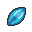</td>
<td>Baie Cobaba</td>
<td>Divise par 2 les dégâts occasionnés par une attaque de type vol super efficace</td>
<td>500</td>
</tr>
<tr>
<td style="text-align: center;">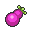</td>
<td>Baie Yapap</td>
<td>Divise par 2 les dégâts occasionnés par une attaque de type psy super efficace</td>
<td>500</td>
</tr>
<tr>
<td style="text-align: center;">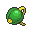</td>
<td>Baie Panga</td>
<td>Divise par 2 les dégâts occasionnés par une attaque de type insecte super efficace</td>
<td>500</td>
</tr>
<tr>
<td style="text-align: center;">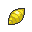</td>
<td>Baie Charti</td>
<td>Divise par 2 les dégâts occasionnés par une attaque de type roche super efficace</td>
<td>500</td>
</tr>
<tr>
<td style="text-align: center;">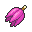</td>
<td>Baie Sédra</td>
<td>Divise par 2 les dégâts occasionnés par une attaque de type Spectre super efficace</td>
<td>500</td>
</tr>
<tr>
<td style="text-align: center;">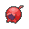</td>
<td>Baie Fraigo</td>
<td>Divise par 2 les dégâts occasionnés par une attaque de type Dragon super efficace</td>
<td>500</td>
</tr>
<tr>
<td style="text-align: center;">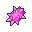</td>
<td>Baie Lampou</td>
<td>Divise par 2 les dégâts occasionnés par une attaque de type Ténèbres super efficace</td>
<td>500</td>
</tr>
<tr>
<td style="text-align: center;">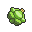</td>
<td>Baie Babiri</td>
<td>Divise par 2 les dégâts occasionnés par une attaque de type acier super efficace</td>
<td>500</td>
</tr>
<tr>
<td style="text-align: center;">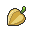</td>
<td>Baie Zalis</td>
<td>Divise par 2 les dégâts occasionnés par la première attaque de type normal encaissée.</td>
<td>500</td>
</tr>
<tr>
<td style="text-align: center;">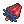</td>
<td>Baie Selro</td>
<td>Divise par 2 les dégâts occasionnés par une attaque de type Fée super efficace</td>
<td>500</td>
</tr>
<tr>
<td style="text-align: center;">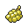</td>
<td>Baie Jaboca</td>
<td>Inflige des dégâts de contrecoup à un adversaire utilisant une attaque physique</td>
<td>500</td>
</tr>
<tr>
<td style="text-align: center;">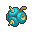</td>
<td>Baie Pommo</td>
<td>Inflige des dégâts de contrecoup à un adversaire utilisant une attaque spéciale</td>
<td>500</td>
</tr>
<tr>
<td style="text-align: center;"></td>
<td>Baie Frista</td>
<td>Augmente l'attaque de +5 lorsque les PV du Pokémon passent sous 1/3 de ses PV max</td>
<td>800</td>
</tr>
<tr>
<td style="text-align: center;">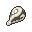</td>
<td>Baie Enigma</td>
<td>Augmente la défense de +5 lorsque les PV du Pokémon passent sous 1/3 de ses PV max</td>
<td>800</td>
</tr>
<tr>
<td style="text-align: center;">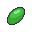</td>
<td>Baie Micle</td>
<td>Augmente la précision de 50% d'une attaque pour un tour</td>
<td>800</td>
</tr>
<tr>
<td style="text-align: center;">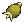</td>
<td>Baie Rangma</td>
<td>Augmente la Défense Spéciale de +5 du Pokémon qui la tient s'il est touché par une attaque spéciale.</td>
<td>800</td>
</tr>
<tr>
<td style="text-align: center;">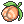</td>
<td>Baie Éka</td>
<td>Augmente la Défense de +5 du Pokémon qui la tient s'il est touché par une attaque physique.</td>
<td>800</td>
</tr>
<tr>
<td style="text-align: center;">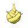</td>
<td>Baie Ginema</td>
<td>Augmente d'un niveau une statistique qui devrait être baissée d'un</td>
<td>800</td>
</tr>
<tr>
<td style="text-align: center;">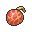</td>
<td>Baie Chérim</td>
<td>Le Pokémon attaquera en premier pour un tour</td>
<td>1000</td>
</tr>
</tbody>
</table>

# Baies ingrédients

<table>
<colgroup>
<col style="width: 7%" />
<col style="width: 18%" />
<col style="width: 65%" />
<col style="width: 8%" />
</colgroup>
<thead>
<tr>
<th colspan="2" style="text-align: center;">Baie</th>
<th>Effet</th>
<th>Prix</th>
</tr>
</thead>
<tbody>
<tr>
<td style="text-align: center;"></td>
<td>Baie Abriko</td>
<td>Ingrédient de Pokéblocs et Poffins</td>
<td>50</td>
</tr>
<tr>
<td style="text-align: center;">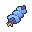</td>
<td>Baie Alga</td>
<td>Ingrédient de Pokéblocs et Poffins</td>
<td>50</td>
</tr>
<tr>
<td style="text-align: center;">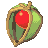</td>
<td>Baie Chilan</td>
<td>Ingrédient de Pokéblocs et Poffins</td>
<td>50</td>
</tr>
<tr>
<td style="text-align: center;">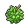</td>
<td>Baie Durin</td>
<td>Ingrédient de Pokéblocs et Poffins</td>
<td>50</td>
</tr>
<tr>
<td style="text-align: center;">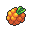</td>
<td>Baie Framby</td>
<td>Ingrédient de Pokéblocs et Poffins</td>
<td>50</td>
</tr>
<tr>
<td style="text-align: center;">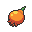</td>
<td>Baie Grena</td>
<td>Ingrédient de Pokéblocs et Poffins</td>
<td>50</td>
</tr>
<tr>
<td style="text-align: center;">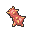</td>
<td>Baie Kiwan</td>
<td>Ingrédient de Pokéblocs et Poffins</td>
<td>50</td>
</tr>
<tr>
<td style="text-align: center;"></td>
<td>Baie Lansat</td>
<td>Ingrédient de Pokéblocs et Poffins</td>
<td>50</td>
</tr>
<tr>
<td style="text-align: center;"></td>
<td>Baie Lichii</td>
<td>Ingrédient de Pokéblocs et Poffins</td>
<td>50</td>
</tr>
<tr>
<td style="text-align: center;"></td>
<td>Baie Lingan</td>
<td>Ingrédient de Pokéblocs et Poffins</td>
<td>50</td>
</tr>
<tr>
<td style="text-align: center;"></td>
<td>Baie Lonme</td>
<td>Ingrédient de Pokéblocs et Poffins</td>
<td>50</td>
</tr>
<tr>
<td style="text-align: center;"></td>
<td>Baie Mangou</td>
<td>Ingrédient de Pokéblocs et Poffins</td>
<td>50</td>
</tr>
<tr>
<td style="text-align: center;"></td>
<td>Baie Myrte</td>
<td>Ingrédient de Pokéblocs et Poffins</td>
<td>50</td>
</tr>
<tr>
<td style="text-align: center;"></td>
<td>Baie Nanab</td>
<td>Ingrédient de Pokéblocs et Poffins</td>
<td>50</td>
</tr>
<tr>
<td style="text-align: center;"></td>
<td>Baie Nanana</td>
<td>Ingrédient de Pokéblocs et Poffins</td>
<td>50</td>
</tr>
<tr>
<td style="text-align: center;"></td>
<td>Baie Niniku</td>
<td>Ingrédient de Pokéblocs et Poffins</td>
<td>50</td>
</tr>
<tr>
<td style="text-align: center;"></td>
<td>Baie Nutpea</td>
<td>Ingrédient de Pokéblocs et Poffins</td>
<td>50</td>
</tr>
<tr>
<td style="text-align: center;"></td>
<td>Baie Palma</td>
<td>Ingrédient de Pokéblocs et Poffins</td>
<td>50</td>
</tr>
<tr>
<td style="text-align: center;"></td>
<td>Baie Pitaye</td>
<td>Ingrédient de Pokéblocs et Poffins</td>
<td>50</td>
</tr>
<tr>
<td style="text-align: center;"></td>
<td>Baie Qualot</td>
<td>Ingrédient de Pokéblocs et Poffins</td>
<td>50</td>
</tr>
<tr>
<td style="text-align: center;"></td>
<td>Baie Rabuta</td>
<td>Ingrédient de Pokéblocs et Poffins</td>
<td>50</td>
</tr>
<tr>
<td style="text-align: center;"></td>
<td>Baie Remu</td>
<td>Ingrédient de Pokéblocs et Poffins</td>
<td>50</td>
</tr>
<tr>
<td style="text-align: center;"></td>
<td>Baie Repoi</td>
<td>Ingrédient de Pokéblocs et Poffins</td>
<td>50</td>
</tr>
<tr>
<td style="text-align: center;"></td>
<td>Baie Resin</td>
<td>Ingrédient de Pokéblocs et Poffins</td>
<td>50</td>
</tr>
<tr>
<td style="text-align: center;"></td>
<td>Baie Sailak</td>
<td>Ingrédient de Pokéblocs et Poffins</td>
<td>50</td>
</tr>
<tr>
<td style="text-align: center;"></td>
<td>Baie Siam</td>
<td>Ingrédient de Pokéblocs et Poffins</td>
<td>50</td>
</tr>
<tr>
<td style="text-align: center;"></td>
<td>Baie Stekpa</td>
<td>Ingrédient de Pokéblocs et Poffins</td>
<td>50</td>
</tr>
<tr>
<td style="text-align: center;"></td>
<td>Baie Strib</td>
<td>Ingrédient de Pokéblocs et Poffins</td>
<td>50</td>
</tr>
<tr>
<td style="text-align: center;"></td>
<td>Baie Tamato</td>
<td>Ingrédient de Pokéblocs et Poffins</td>
<td>50</td>
</tr>
<tr>
<td style="text-align: center;"></td>
<td>Baie Topo</td>
<td>Ingrédient de Pokéblocs et Poffins</td>
<td>50</td>
</tr>
<tr>
<td style="text-align: center;"></td>
<td>Baie Tronci</td>
<td>Ingrédient de Pokéblocs et Poffins</td>
<td>50</td>
</tr>
<tr>
<td style="text-align: center;"></td>
<td>Baie Yago</td>
<td>Ingrédient de Pokéblocs et Poffins</td>
<td>50</td>
</tr>
</tbody>
</table>

# Noigrume

Les noigrumes servent à faire des Pokéball spéciales dont seul Fargas a le secret.

<table>
<colgroup>
<col style="width: 7%" />
<col style="width: 18%" />
<col style="width: 65%" />
<col style="width: 9%" />
</colgroup>
<thead>
<tr>
<th colspan="2">Noigrume</th>
<th>Effet</th>
<th>Prix</th>
</tr>
</thead>
<tbody>
<tr>
<td></td>
<td>Noigrume Blanc</td>
<td>
Un Noigrume de couleur blanche. Il ne dégage aucun arôme.


Sert à fabriquer la Speed ball.
</td>
<td>100</td>
</tr>
<tr>
<td></td>
<td>Noigrume Bleu</td>
<td>
Un Noigrume de couleur bleue. Il dégage un arôme un peu aigre.


Sert à fabriquer la Appât ball.
</td>
<td>100</td>
</tr>
<tr>
<td></td>
<td>Noigrume Jaune</td>
<td>
Un Noigrume de couleur jaune. Il dégage un arôme délicat.


Sert à fabriquer la Lune ball.
</td>
<td>100</td>
</tr>
<tr>
<td></td>
<td>Noigrume Noire</td>
<td>
Un Noigrume de couleur noire. Il dégage un arôme indéfinissable.


Sert à fabriquer la Masse ball.
</td>
<td>100</td>
</tr>
<tr>
<td></td>
<td>Noigrume Rouge</td>
<td>
Un Noigrume de couleur rouge. Il dégage un puissant arôme.


Sert à fabriquer la Niveau ball.
</td>
<td>100</td>
</tr>
<tr>
<td></td>
<td>Noigrume Rose</td>
<td>
Un Noigrume de couleur rose. Il dégage un arôme sucré.


Sert à fabriquer la Love ball.
</td>
<td>100</td>
</tr>
<tr>
<td></td>
<td>Noigrume Verte</td>
<td>
Un Noigrume de couleur verte. Il dégage un arôme étonnamment riche.


Sert à fabriquer la Copain ball.
</td>
<td>100</td>
</tr>
</tbody>
</table>

# CT/CS

<table>
<colgroup>
<col style="width: 9%" />
<col style="width: 15%" />
<col style="width: 65%" />
<col style="width: 9%" />
</colgroup>
<thead>
<tr>
<th><strong>Numéro</strong></th>
<th><strong>Nom</strong></th>
<th><strong>Effets</strong></th>
<th><strong>Prix</strong></th>
</tr>
</thead>
<tbody>
<tr>
<td>CT1</td>
<td>À la Queue</td>
<td>Force la cible à attaquer en dernier.</td>
<td>5000</td>
</tr>
<tr>
<td>CT2</td>
<td>Abîme</td>
<td>Met les cibles KO. 
Précision = (Niveau du lanceur - Niveau de la cible) + 30</td>
<td>20000</td>
</tr>
<tr>
<td>CT3</td>
<td>Aboiement</td>
<td>Baisser la Concentration de la cible de -1.</td>
<td>10000</td>
</tr>
<tr>
<td>CT4</td>
<td>Abri</td>
<td>Protège de tout effet, direct ou indirect, d'une attaque de la cible. Si réutilisé, 50% de chances de réussite, puis 25% et enfin 12.5%. À la cinquième utilisation successive, Abri échouera systématiquement.</td>
<td>5000</td>
</tr>
<tr>
<td>CT5</td>
<td>Acrobatie</td>
<td>L'attaque est de 6 si le lanceur ne tient pas d'objet sinon elle est de 11.</td>
<td>10000</td>
</tr>
<tr>
<td>CT6</td>
<td>Aéropique</td>
<td>La technique n'échoue jamais, excepté si la cible est dans le premier tour d'attaques comme Plongée ou Tunnel.</td>
<td>10000</td>
</tr>
<tr>
<td>CT7</td>
<td>Aiguisage</td>
<td>Augmente la Force du lanceur de +1 et sa Précision de +10%.</td>
<td>5000</td>
</tr>
<tr>
<td>CT8</td>
<td>Aile D'Acier</td>
<td>Sur 10 augmente l'Endurance du lanceur de +1.</td>
<td>10000</td>
</tr>
<tr>
<td>CT9</td>
<td>Anti-Air</td>
<td>Rend les Pokémon de type vol ainsi que ceux possédant les effets de type vol sensibles aux attaques Sol.</td>
<td>10000</td>
</tr>
<tr>
<td>CT10</td>
<td>Anti-Brume</td>
<td>Réduit l'esquive de la cible d'un niveau. Dissipe toutes les capacités de type Pics Toxik, Piège de Roc, Toile Gluante, Picots, et ce du côté adverse comme du côté joueur. Efface aussi Brume, Rune Protect, Protection et Mur Lumière, mais seulement du côté adverse.</td>
<td>5000</td>
</tr>
<tr>
<td>CT11</td>
<td>Atterrissage</td>
<td>Restaure la moitié de la Vitalité maximale du lanceur. Pendant ce tour si le type du lanceur est Vol celui-ci devient Normal.</td>
<td>5000</td>
</tr>
<tr>
<td>CT12</td>
<td>Attraction</td>
<td>Attraction rend la cible amoureuse si celle-ci est de sexe opposé. La cible n'a qu'une chance sur deux d'attaquer le lanceur.</td>
<td>5000</td>
</tr>
<tr>
<td>CT13</td>
<td>Avalanche</td>
<td>Les dégâts de base de l'attaque sont de 12 si le lanceur a déjà encaissé des dégâts durant ce tour, sinon ils sont de 6.</td>
<td>10000</td>
</tr>
<tr>
<td>CT14</td>
<td>Balayette</td>
<td>Baisse la Dextérité de la cible de -1.</td>
<td>10000</td>
</tr>
<tr>
<td>CT15</td>
<td>Balle Graine</td>
<td>Le lanceur attaque de 2 à 5 fois sur jusqu'à 5 cibles.</td>
<td>10000</td>
</tr>
<tr>
<td>CT16</td>
<td>Ball'Ombre</td>
<td>Sur 9-10 baisse la Volonté de la cible de -1.</td>
<td>15000</td>
</tr>
<tr>
<td>CT17</td>
<td>Bélier</td>
<td>Le lanceur subit 1/4 des dégâts infligés en tant que dégâts de recul. 
Si le lanceur possède Tête de Roc il ne subit pas les dégâts de recul.</td>
<td>10000</td>
</tr>
<tr>
<td>CT18</td>
<td>Blabla Dodo</td>
<td>Le lanceur utilise une technique au hasard parmi toutes les techniques existantes s'il est endormi. 
Aucune énergie n'est utilisée pour lancer la technique au hasard.</td>
<td>5000</td>
</tr>
<tr>
<td>CT19</td>
<td>Blizzard</td>
<td>Sur 10 gèle la cible. 
S'il gèle sur le terrain, le précision ce l'attaque passe à 100% et a 30% de chance de passer au travers d'Abri ou de Détection.</td>
<td>20000</td>
</tr>
<tr>
<td>CT20</td>
<td>Bomb-Beurk</td>
<td>Sur 8-10 empoisonne la cible.</td>
<td>15000</td>
</tr>
<tr>
<td>CT21</td>
<td>Bomb'Oeuf</td>
<td>Un jet d'œuf sur la cible.</td>
<td>10000</td>
</tr>
<tr>
<td>CT22</td>
<td>Boost</td>
<td>Copie les changements de Stats de la cible.</td>
<td>5000</td>
</tr>
<tr>
<td>CT23</td>
<td>Boul'Armure</td>
<td>Augmente l'Endurance du lanceur de +2.</td>
<td>5000</td>
</tr>
<tr>
<td>CT24</td>
<td>Bulles D'O</td>
<td>Sur 10 abaisse la Dextérité des cibles de -1.</td>
<td>10000</td>
</tr>
<tr>
<td>CT25</td>
<td>Cage-Éclair</td>
<td>Paralyse la cible sauf si celle-ci est déjà victime d'un problème de statut majeur ou si elle se trouve derrière un clone. Cette attaque ne fonctionne pas contre les Pokémon de type Électrik.</td>
<td>5000</td>
</tr>
<tr>
<td>CT26</td>
<td>Calcination</td>
<td>Rend la baie ou le joyau tenu par la cible inutilisable.</td>
<td>10000</td>
</tr>
<tr>
<td>CT27</td>
<td>Câlinerie</td>
<td>Sur 10 baisse la Force de la cible de -1.</td>
<td>20000</td>
</tr>
<tr>
<td>CT28</td>
<td>Cascade</td>
<td>Sur 9-10 apeure la cible.</td>
<td>5000</td>
</tr>
<tr>
<td>CT29</td>
<td>Casse-Brique</td>
<td>Annule les effets de Mur Lumière et/ou de Protection même si Casse-Brique échoue sauf si la cible est de type Spectre.</td>
<td>10000</td>
</tr>
<tr>
<td>CT30</td>
<td>Cauchemar</td>
<td>Retire 1/4 de la Vitalité maximale de la cible si elle est endormie.</td>
<td>10000</td>
</tr>
<tr>
<td>CT31</td>
<td>Centrifugifle</td>
<td>Le lanceur pivote pour prendre de l'élan et infliger des dégâts.</td>
<td>10000</td>
</tr>
<tr>
<td>CT32</td>
<td>Change Éclair</td>
<td>Change de Pokémon si l'attaque atteint sa cible et que vous avez au minimum un Pokémon à envoyer sur le terrain</td>
<td>10000</td>
</tr>
<tr>
<td>CT33</td>
<td>Chant Canon</td>
<td>Si plusieurs Pokémon utilisent l'attaque pendant le tour, l'attaque double à chaque utilisation pendant ce même tour.</td>
<td>10000</td>
</tr>
<tr>
<td>CT34</td>
<td>Choc Psy</td>
<td>Inflige des dégâts basés sur l'Endurance et non la Volonté de la cible.</td>
<td>10000</td>
</tr>
<tr>
<td>CT35</td>
<td>Choc Venin</td>
<td>La puissance de l'attaque est doublée si l'adversaire est empoisonné.</td>
<td>10000</td>
</tr>
<tr>
<td>CT36</td>
<td>Chute Libre</td>
<td>Emporte l'adversaire dans les airs au premier tour l'empêchant d'attaquer, puis le fait tomber au second.</td>
<td>10000</td>
</tr>
<tr>
<td>CT37</td>
<td>Clonage</td>
<td>Sacrifie 25% de la Vitalité max pour crée un clone identique à lui-même mais possédant 25% de la Vitalité max du lanceur.</td>
<td>5000</td>
</tr>
<tr>
<td>CT38</td>
<td>Colère</td>
<td>La technique dure pendant 2 à 3 tours et rend le lanceur confus au troisième tour sauf si l'attaque échoue avant ou est interrompue.</td>
<td>20000</td>
</tr>
<tr>
<td>CT39</td>
<td>Confidence</td>
<td>Baisse la Concentration de la cible de -1. N'échoue jamais.</td>
<td>5000</td>
</tr>
<tr>
<td>CT40</td>
<td>Copie</td>
<td>Copie imite la dernière attaque de la cible pour la durée du combat et disparait si le lanceur de Copie tombe K.O. ou se retire.</td>
<td>10000</td>
</tr>
<tr>
<td>CT41</td>
<td>Coud'Boue</td>
<td>Baisse la précision de la cible de -10%.</td>
<td>10000</td>
</tr>
<tr>
<td>CT42</td>
<td>Coud'Krâne</td>
<td>Le lanceur se recule au premier tour et frappe la cible au second.</td>
<td>10000</td>
</tr>
<tr>
<td>CT43</td>
<td>Coup D'Boule</td>
<td>Sur 8-10 apeure la cible.</td>
<td>10000</td>
</tr>
<tr>
<td>CT44</td>
<td>Coup D'Main</td>
<td>Augmente les dégâts de l'attaque du partenaire de 50 %.</td>
<td>10000</td>
</tr>
<tr>
<td>CT45</td>
<td>Coupe</td>
<td>Coupe inflige des dégâts et ne présente pas d'effet secondaire particulier.</td>
<td>5000</td>
</tr>
<tr>
<td>CT46</td>
<td>Coupe-Vent</td>
<td>Le lanceur génère une bourrasque de vent qui frappe les cibles dans la zone concernée au tour prochain.</td>
<td>10000</td>
</tr>
<tr>
<td>CT47</td>
<td>Cradovague</td>
<td>Sur 10 empoisonne la cible.</td>
<td>20000</td>
</tr>
<tr>
<td>CT48</td>
<td>Cyclone</td>
<td>Éparpille les Pokémon dans la zone. Cela peut mettre fin au combat contre un Pokémon sauvage ou de remplacer le Pokémon adverse par l'un des autres Pokémon de son équipe (choisi aléatoirement).</td>
<td>10000</td>
</tr>
<tr>
<td>CT49</td>
<td>Damoclès</td>
<td>Une charge qui retire un dixième de la Vitalité du lanceur à chaque coup infligé en tant que dégâts de recul.</td>
<td>10000</td>
</tr>
<tr>
<td>CT50</td>
<td>Danse Pluie</td>
<td>La pluie tombe pendant 5 tours (8 tours si Roche Humide est tenu). Augmente les dégâts des techniques de type Eau de 50% et baisse ceux du type Feu de 50%.</td>
<td>5000</td>
</tr>
<tr>
<td>CT51</td>
<td>Danse-Lames</td>
<td>Baisse la Force de la cible de -2.</td>
<td>5000</td>
</tr>
<tr>
<td>CT52</td>
<td>Déflagration</td>
<td>Sur 10 brûle les cibles.</td>
<td>20000</td>
</tr>
<tr>
<td>CT53</td>
<td>Dégommage</td>
<td>Si le lanceur tient un objet, il le lance sur la cible et lui inflige 10 dégâts si l'objet n'est pas une Baie, sinon ils sont de 5.</td>
<td>5000</td>
</tr>
<tr>
<td>CT54</td>
<td>Demi-Tour</td>
<td>Le lanceur attaque la cible et peut être échangé avec un autre Pokémon de l'équipe.</td>
<td>10000</td>
</tr>
<tr>
<td>CT55</td>
<td>Destruction</td>
<td>Le lanceur est mis KO.</td>
<td>10000</td>
</tr>
<tr>
<td>CT56</td>
<td>Détection</td>
<td>Esquive une attaque de la cible. Si réutilisé, 50% de chances de réussite, puis 25% et enfin 12.5%. À la cinquième utilisation successive, Détection échouera systématiquement.</td>
<td>10000</td>
</tr>
<tr>
<td>CT57</td>
<td>Dévorêve</td>
<td>Le lanceur récupère la moitié de la Vitalité qu'a perdue la cible. La technique ne fonctionne que si la cible est endormie.</td>
<td>10000</td>
</tr>
<tr>
<td>CT58</td>
<td>Direct Toxik</td>
<td>Sur 8-10 empoisonne la cible.</td>
<td>10000</td>
</tr>
<tr>
<td>CT59</td>
<td>Distorsion</td>
<td>Inverse l'ordre dans lequel les Pokémon de la zone attaquent pendant 5 tours. Fait effet en dernier.</td>
<td>5000</td>
</tr>
<tr>
<td>CT60</td>
<td>Don naturel</td>
<td>Les dégâts de base de l'attaque sont de 10 si la cible utilise sa Baie, sinon ils sont de 5.</td>
<td>5000</td>
</tr>
<tr>
<td>CT61</td>
<td>Doux Parfum</td>
<td>Baisse le Dextérité des Pokémons autour de -2.</td>
<td>5000</td>
</tr>
<tr>
<td>CT62</td>
<td>Dracochoc</td>
<td>Si le lanceur possède le talent Méga Blaster, la puissance de l'attaque est augmentée de 50%</td>
<td>15000</td>
</tr>
<tr>
<td>CT63</td>
<td>Dracogriffe</td>
<td>Un coup de griffes.</td>
<td>10000</td>
</tr>
<tr>
<td>CT64</td>
<td>Draco-Queue</td>
<td>Met fin à un combat contre un Pokémon sauvage. Ne fonctionne pas contre une horde. Lors d'un duel remplace le Pokémon adverse par l'un des Pokémon de son équipe.</td>
<td>10000</td>
</tr>
<tr>
<td>CT65</td>
<td>Draco-Rage</td>
<td>Le lanceur envoie des ondes de choc retirant 8 points de Vitalité.</td>
<td>5000</td>
</tr>
<tr>
<td>CT66</td>
<td>Dracosouffle</td>
<td>Sur 8-10 paralyse la cible.</td>
<td>10000</td>
</tr>
<tr>
<td>CT67</td>
<td>Dynamopoing</td>
<td>Rend confus la cible.</td>
<td>10000</td>
</tr>
<tr>
<td>CT68</td>
<td>Éboulement</td>
<td>Sur 8-10 apeure la cible.</td>
<td>15000</td>
</tr>
<tr>
<td>CT69</td>
<td>Ébullition</td>
<td>Sur 8-10 brûle les cibles.</td>
<td>10000</td>
</tr>
<tr>
<td>CT70</td>
<td>Échange</td>
<td>Le lanceur et la cible échangent leurs Capacités Spéciales.</td>
<td>5000</td>
</tr>
<tr>
<td>CT71</td>
<td>Écho</td>
<td>À chaque fois que cette technique est réutilisée par le lanceur, les dégâts de base de la technique sont doublés, jusqu'à atteindre 20. L'effet est annulé si la lanceur rate son attaque ou en utilise une autre.</td>
<td>10000</td>
</tr>
<tr>
<td>CT72</td>
<td>Éclair Fou</td>
<td>Le lanceur reçoit 1/4 des dégâts infligés.</td>
<td>15000</td>
</tr>
<tr>
<td>CT73</td>
<td>Éclat Magique</td>
<td>Libère une puissante décharge lumineuse qui inflige des dégâts à l'ennemi.</td>
<td>10000</td>
</tr>
<tr>
<td>CT74</td>
<td>Éclate-Roc</td>
<td>Sur 6-10 baisse l'Endurance de la cible de -1.</td>
<td>10000</td>
</tr>
<tr>
<td>CT75</td>
<td>E-Coque</td>
<td>Restaure la moitié de la Vitalité maximale du lanceur.</td>
<td>10000</td>
</tr>
<tr>
<td>CT76</td>
<td>Éco-Sphère</td>
<td>Sur 10 baisse la Volonté de la cible de -1.</td>
<td>15000</td>
</tr>
<tr>
<td>CT77</td>
<td>Élécanon</td>
<td>Paralyse la cible.</td>
<td>10000</td>
</tr>
<tr>
<td>CT78</td>
<td>Embargo</td>
<td>Empêche la cible d'utiliser un objet tenu et son Dresseur d'utiliser un objet sur lui pendant 5 tours.</td>
<td>5000</td>
</tr>
<tr>
<td>CT79</td>
<td>Empal'Korne</td>
<td>Précision = (Niveau du Lanceur - Niveau de la cible) + 30 
Si l'attaque passe, la cible est KO.</td>
<td>20000</td>
</tr>
<tr>
<td>CT80</td>
<td>Escalade</td>
<td>Sur 9-10 rend la cible confuse.</td>
<td>5000</td>
</tr>
<tr>
<td>CT81</td>
<td>Estocorne</td>
<td>N'échoue jamais, excepté si la cible est dans le premier tour de capacités comme Plongée, Tunnel ou Vol.</td>
<td>10000</td>
</tr>
<tr>
<td>CT82</td>
<td>Exploforce</td>
<td>Sur 9-10 abaisse la Volonté de la cible de -1.</td>
<td>20000</td>
</tr>
<tr>
<td>CT83</td>
<td>Explosion</td>
<td>Le lanceur est mis KO.</td>
<td>20000</td>
</tr>
<tr>
<td>CT84</td>
<td>Façade</td>
<td>Si le lanceur est brûlé, paralysé ou empoisonné les dégâts sont de 14. 
Sinon les dégâts sont de 7.</td>
<td>10000</td>
</tr>
<tr>
<td>CT85</td>
<td>Fatal-Foudre</td>
<td>Dans des conditions normales, la précision est de 70%. Sous la pluie, la précision est de 100%. En plein Soleil la précision est de 50%. 
Sur 8-10 paralyse la cible.</td>
<td>20000</td>
</tr>
<tr>
<td>CT86</td>
<td>Faux-Chage</td>
<td>Si la technique devait mettre KO la cible, à la place sa Vitalité reste à 1.</td>
<td>5000</td>
</tr>
<tr>
<td>CT87</td>
<td>Feu Follet</td>
<td>Inflige une brûlure à la cible. L'attaque est sans effet sur les types Feu.</td>
<td>5000</td>
</tr>
<tr>
<td>CT88</td>
<td>Flash</td>
<td>Baisse la Précision des Pokémon dans la zone de -10%.</td>
<td>5000</td>
</tr>
<tr>
<td>CT89</td>
<td>Force</td>
<td>Force inflige des dégâts, sans effet secondaire.</td>
<td>5000</td>
</tr>
<tr>
<td>CT90</td>
<td>Force Cachée</td>
<td>Sur 8-10 change le statut de la cible.</td>
<td>10000</td>
</tr>
<tr>
<td>CT91</td>
<td>Force-Nature</td>
<td>Toutes les attaques lancées sont spéciales et dépendent du lieu.</td>
<td>5000</td>
</tr>
<tr>
<td>CT92</td>
<td>Frappe Atlas</td>
<td>Inflige 1/6 de la Vitalité max de la cible.</td>
<td>10000</td>
</tr>
<tr>
<td>CT93</td>
<td>Frénésie</td>
<td>Augmente la Force du lanceur de +1 à chaque coup reçu pendant ce tour.</td>
<td>5000</td>
</tr>
<tr>
<td>CT94</td>
<td>Frustration</td>
<td>Les dégâts de base de l'attaque sont égaux à la Soumission du Pokémon.</td>
<td>10000</td>
</tr>
<tr>
<td>CT95</td>
<td>Giga Impact</td>
<td>Une charge qui oblige le lanceur à se reposer au tour suivant.</td>
<td>20000</td>
</tr>
<tr>
<td>CT96</td>
<td>Giga-Sangsue</td>
<td>Le lanceur récupère la moitié de la Vitalité qu'a perdue la cible.</td>
<td>15000</td>
</tr>
<tr>
<td>CT97</td>
<td>Gonflette</td>
<td>Augmente l'Endurance et la Force du lanceur de +1.</td>
<td>5000</td>
</tr>
<tr>
<td>CT98</td>
<td>Grêle</td>
<td>La grêle tombe pendant 5 tours (8 tours si Roche Glace est tenu). À chaque tour, les Pokémon qui ne sont pas de type glace perdent 1/10 de leur Vitalité maximale.</td>
<td>5000</td>
</tr>
<tr>
<td>CT99</td>
<td>Griffe Ombre</td>
<td>Ajoute +1 sur le résultat du dé 10 pour cette attaque.</td>
<td>10000</td>
</tr>
<tr>
<td>CT100</td>
<td>Gyroballe</td>
<td>Les dégâts de base de la technique sont de 12 si la Dextérité du lanceur est inférieure à celle des cibles, sinon ils sont de 6.</td>
<td>10000</td>
</tr>
<tr>
<td>CT101</td>
<td>Harcèlement</td>
<td>La cible perd 1/8 de sa Vitalité Max pendant 5 tours. La cible ne peut ni se retirer ni fuir.</td>
<td>10000</td>
</tr>
<tr>
<td>CT102</td>
<td>Hurlement</td>
<td>Met fin à un combat contre un Pokémon sauvage. Ne fonctionne pas contre une horde. Lors d'un duel remplace le Pokémon adverse par l'un des Pokémon de son équipe.</td>
<td>5000</td>
</tr>
<tr>
<td>CT103</td>
<td>Interversion</td>
<td>Interversion permet de changer sa position avec un allié, au cours d'un combat double ou triple. Le lanceur augmente son Initiative de +10 pendant ce tour.</td>
<td>5000</td>
</tr>
<tr>
<td>CT104</td>
<td>Jackpot</td>
<td>Une charge qui fait apparaître 15 Poké $ à chaque cible atteinte.</td>
<td>15000</td>
</tr>
<tr>
<td>CT105</td>
<td>Lame de Roc</td>
<td>La difficulté du jet de dégâts est réduite pour cette attaque.</td>
<td>20000</td>
</tr>
<tr>
<td>CT106</td>
<td>Lance-Flammes</td>
<td>Sur 10 brûle la cible.</td>
<td>15000</td>
</tr>
<tr>
<td>CT107</td>
<td>Lance-Soleil</td>
<td>Le lanceur accumule de l'énergie au premier tour et envoie un rayon au second. Si le soleil brille fortement, le lanceur peut accumuler l'énergie et la relâcher en un seul tour.</td>
<td>20000</td>
</tr>
<tr>
<td>CT108</td>
<td>Larcin</td>
<td>Le lanceur vole l'objet de la cible.</td>
<td>10000</td>
</tr>
<tr>
<td>CT109</td>
<td>Laser Glace</td>
<td>Sur 10 gèle la cible.</td>
<td>15000</td>
</tr>
<tr>
<td>CT110</td>
<td>Lévikinésie</td>
<td>La cible est soulevée dans les airs pendant 3 tours. Elle est immunisée aux attaques de type Sol, à picots, pics Toxik et piège. En revanche les attaques qu'elle subit de peuvent pas échouer.</td>
<td>5000</td>
</tr>
<tr>
<td>CT111</td>
<td>Luminocanon</td>
<td>Sur 10 abaisse la Volonté des cibles de -1.</td>
<td>15000</td>
</tr>
<tr>
<td>CT112</td>
<td>Malédiction</td>
<td>Si le lanceur est de type spectre, il sacrifie la moitié de sa Vitalité maximale pour maudire une cible qui perd 1/4 de sa Vitalité à chaque tour. 
Sinon augmente la Force et l'Endurance du lanceur de +1 et baisse sa Dextérité de -1.</td>
<td>10000</td>
</tr>
<tr>
<td>CT113</td>
<td>Mégacorne</td>
<td>Une attaque en charge.</td>
<td>15000</td>
</tr>
<tr>
<td>CT114</td>
<td>Méga-Sangsue</td>
<td>Le lanceur récupère la moitié de la Vitalité qu'a perdue la cible.</td>
<td>10000</td>
</tr>
<tr>
<td>CT115</td>
<td>Météores</td>
<td>Ne rate jamais.</td>
<td>5000</td>
</tr>
<tr>
<td>CT116</td>
<td>Métronome</td>
<td>Le lanceur utilise une technique au hasard parmi toutes les techniques existantes.</td>
<td>10000</td>
</tr>
<tr>
<td>CT117</td>
<td>Mitra-Poing</td>
<td>Si le lanceur est touché par une attaque avant d'utiliser cette technique, il est déconcentré et ne peut pas attaquer.</td>
<td>20000</td>
</tr>
<tr>
<td>CT118</td>
<td>Mur Lumière</td>
<td>Divise par 2 la Concentration des Pokémons adverses pendant 5 tours (8 tours si Lumargile est tenu).</td>
<td>5000</td>
</tr>
<tr>
<td>CT119</td>
<td>Nitrocharge</td>
<td>Augmente la Dextérité du lanceur de +1.</td>
<td>5000</td>
</tr>
<tr>
<td>CT120</td>
<td>Nœud Herbe</td>
<td>Les dégâts de la technique dépendent de son poids : moins de 10kg inflige 2 dégâts ; de 10,1 à 25kg : 4; de 25,1 à 50 : 6; de 50,1 à 100 : 8; de 100,1 à 200 : 10; plus de 200,1 kg : 12. 
Les cibles dans la zone concernée sont immobilisées pendant 5 tours.</td>
<td>10000</td>
</tr>
<tr>
<td>CT121</td>
<td>Onde De Choc</td>
<td>N'échoue jamais, sauf si la cible est de type Sol ou dans le premier tour d'attaques comme Plongée, Tunnel ou Vol.</td>
<td>5000</td>
</tr>
<tr>
<td>CT122</td>
<td>Patience</td>
<td>Le lanceur encaisse des attaques sur 2 tours sans riposter et inflige le double de dégâts à la cible sans tenir compte des types.</td>
<td>5000</td>
</tr>
<tr>
<td>CT123</td>
<td>Picore</td>
<td>Si la cible tient un baie les dégâts sont de 12 et le lanceur vole la Baie de la cible et s'appliquant ses effets. Sinon inflige 6 dégâts à la cible.</td>
<td>10000</td>
</tr>
<tr>
<td>CT124</td>
<td>Piège de Roc</td>
<td>Inflige 4 dégâts de type Roche aux Pokémon se déplaçant dans la zone.</td>
<td>5000</td>
</tr>
<tr>
<td>CT125</td>
<td>Piétisol</td>
<td>Baisse la Dextérité de la cible de -1.</td>
<td>10000</td>
</tr>
<tr>
<td>CT126</td>
<td>Piqué</td>
<td>Le Pokémon s'envole au premier tour et attaque au second. Sur 8-10 apeure la cible. Ajoute +1 sur le résultat du dé 10 pour cette attaque.</td>
<td>10000</td>
</tr>
<tr>
<td>CT127</td>
<td>Pistolet à O</td>
<td>Un jet d'eau sur un rayon.</td>
<td>5000</td>
</tr>
<tr>
<td>CT128</td>
<td>Plaie-Croix</td>
<td>Le lanceur taillade la cible.</td>
<td>15000</td>
</tr>
<tr>
<td>CT129</td>
<td>Plaquage</td>
<td>Sur 8-10 paralyse la cible.</td>
<td>10000</td>
</tr>
<tr>
<td>CT130</td>
<td>Plénitude</td>
<td>Augmente la Concentration et la Volonté du lanceur de +1.</td>
<td>5000</td>
</tr>
<tr>
<td>CT131</td>
<td>Plongée</td>
<td>Au premier tour le lanceur plonge sous l'eau et attaque au second.</td>
<td>5000</td>
</tr>
<tr>
<td>CT132</td>
<td>Poing Boost</td>
<td>Augmente la Force du lanceur de +1 à chaque utilisation.</td>
<td>10000</td>
</tr>
<tr>
<td>CT133</td>
<td>Poing De Feu</td>
<td>Sur 9-10 brûle la cible.</td>
<td>10000</td>
</tr>
<tr>
<td>CT134</td>
<td>Poing-Éclair</td>
<td>Sur 10 paralyse la cible sauf si celle-ci est déjà victime d'un problème de statut majeur ou derrière un clone.</td>
<td>10000</td>
</tr>
<tr>
<td>CT135</td>
<td>Poing-Glace</td>
<td>Sur 10 gèle la cible sauf si celle-ci est déjà victime d'un problème de statut majeur ou derrière un clone.</td>
<td>10000</td>
</tr>
<tr>
<td>CT136</td>
<td>Poliroche</td>
<td>Augmente la Dextérité du lanceur de +2.</td>
<td>5000</td>
</tr>
<tr>
<td>CT137</td>
<td>Protection</td>
<td>Divise par 2 la Force des Pokémons adverses pendant 5 tours (8 tours si Lumargile est tenu).</td>
<td>5000</td>
</tr>
<tr>
<td>CT138</td>
<td>Provoc</td>
<td>Provoque la cible et l'oblige à n'utiliser que des attaques pendant trois tours. Provoc empêche la cible d'utiliser des attaques de statut.</td>
<td>5000</td>
</tr>
<tr>
<td>CT139</td>
<td>Psyko</td>
<td>Sur 10 baisse la Volonté de la cible de -1.</td>
<td>20000</td>
</tr>
<tr>
<td>CT140</td>
<td>Puissance Cachée</td>
<td>Le type de la technique est défini la première fois qu'elle est utilisée. Lancer 2 dés 8 et le type est égal au résultat - 1 : 
1:Combat; 2:Vol; 3 Poison; 4:Sol; 5:Roche; 6:Insecte; 7:Spectre; 8:Acier; 9:Feu; 10:Eau; 11:Plante; 12:Electique; 13:Psy; 14:Glace; 15:Dragon; 16:Ténèbres.</td>
<td>10000</td>
</tr>
<tr>
<td>CT141</td>
<td>Queue De Fer</td>
<td>Sur 10 baisse l'Endurance de la cible de -1.</td>
<td>20000</td>
</tr>
<tr>
<td>CT142</td>
<td>Rayon Chargé</td>
<td>Sur 3-70 augmente la Concentration du lanceur de +1.</td>
<td></td>
</tr>
<tr>
<td>CT143</td>
<td>Recyclage</td>
<td>Applique les effets d'un objet à usage unique sans le consommer.</td>
<td>5000</td>
</tr>
<tr>
<td>CT144</td>
<td>Reflet</td>
<td>Augmente la Dextérité de +1.</td>
<td>5000</td>
</tr>
<tr>
<td>CT145</td>
<td>Rengorgement</td>
<td>Augmente la Force et la Concentration du lanceur de +1.</td>
<td>5000</td>
</tr>
<tr>
<td>CT146</td>
<td>Repos</td>
<td>Le lanceur dort pendant trois tours. Il regagne sa Vitalité maximale et sa condition.</td>
<td>5000</td>
</tr>
<tr>
<td>CT147</td>
<td>Représailles</td>
<td>Les dégâts de base de l'attaque sont de 10 si la cible a déjà utilisé une technique sur le lanceur durant ce tour, sinon ils sont de 5.</td>
<td>10000</td>
</tr>
<tr>
<td>CT148</td>
<td>Retour</td>
<td>Les dégâts de base de l'attaque sont égaux à la Confiance du Pokémon.</td>
<td>10000</td>
</tr>
<tr>
<td>CT149</td>
<td>Riposte</td>
<td>Si le lanceur est touché par une attaque physique ce tour-ci, il inflige deux fois les dégâts subit, sans tenir compte des types.</td>
<td>10000</td>
</tr>
<tr>
<td>CT150</td>
<td>Ronflement</td>
<td>Sur 8-10 apeure la cible.</td>
<td>5000</td>
</tr>
<tr>
<td>CT151</td>
<td>Roulade</td>
<td>Dure cinq tours, doublant sa puissance à chaque tour. (revient à 3 après les cinq tours, ou si l'attaque échoue). La puissance est doublée si le lanceur a utilisé Boul'Armure précédemment pendant le combat.</td>
<td>5000</td>
</tr>
<tr>
<td>CT152</td>
<td>Rune Protect</td>
<td>Le lanceur et ses alliés sont protégés contre les changements de condition.</td>
<td>5000</td>
</tr>
<tr>
<td>CT153</td>
<td>Sacrifice</td>
<td>Une charge qui retire un dixième de la Vitalité du lanceur à chaque coup infligé.</td>
<td>10000</td>
</tr>
<tr>
<td>CT154</td>
<td>Saisie</td>
<td>Acquière les effets des capacités de soin ou de changement de stats utilisés par l'ennemi.</td>
<td>5000</td>
</tr>
<tr>
<td>CT155</td>
<td>Saumure</td>
<td>Les dégâts de base de l'attaque sont de 14 si la cible a moins de la moitié de sa Vitalité maximale, sinon ils sont de 7.</td>
<td>10000</td>
</tr>
<tr>
<td>CT156</td>
<td>Séduction</td>
<td>Si la cible est du sexe opposé au lanceur, sa Concentration baisse de -2.</td>
<td>5000</td>
</tr>
<tr>
<td>CT157</td>
<td>Séisme</td>
<td>Les dégâts sont doublés si l'attaque est utilisée durant le tour où l'adversaire est sous terre quand il utilise Tunnel.</td>
<td>20000</td>
</tr>
<tr>
<td>CT158</td>
<td>Souffle Glacé</td>
<td>Tous les coups sont des coups critiques.</td>
<td>10000</td>
</tr>
<tr>
<td>CT159</td>
<td>Surchauffe</td>
<td>Baisse la Concentration du lanceur de -2.</td>
<td>20000</td>
</tr>
<tr>
<td>CT160</td>
<td>Surf</td>
<td>Le lanceur crée une vague d'eau qui s'abat sur les cibles dans la zone concernée.</td>
<td>5000</td>
</tr>
<tr>
<td>CT161</td>
<td>Surpuissance</td>
<td>Baisse la Force et l'Endurance du lanceur de -2.</td>
<td>15000</td>
</tr>
<tr>
<td>CT162</td>
<td>Survinsecte</td>
<td>Baisse la Concentration de la cible de -1.</td>
<td>10000</td>
</tr>
<tr>
<td>CT163</td>
<td>Taillade</td>
<td>À chaque fois que cette technique est réutilisée par le lanceur, les dégâts de base de la technique sont doublés, jusqu'à atteindre 16. L'effet est annulé si la lanceur rate son attaque ou en utilise une autre.</td>
<td>5000</td>
</tr>
<tr>
<td>CT164</td>
<td>Téléport</td>
<td>Le lanceur se téléporte. Il peut quitter un combat contre un Pokémon Sauvage de cette manière. Echoue face à un dresseur.</td>
<td>5000</td>
</tr>
<tr>
<td>CT165</td>
<td>Tempête de Sable</td>
<td>Dure 5 tours. À chaque tour, retire 1/10 de la Vitalité max à tous les Pokémon sur le terrain qui ne sont pas de type Roche, Sol ou Acier. 
Augmente de 50% la Volonté des Pokémon de type Roche sous Tempête de Sable.</td>
<td>5000</td>
</tr>
<tr>
<td>CT166</td>
<td>Ténacité</td>
<td>Si le lanceur devait tomber KO ce tour-ci, à la place sa Vitalité tombe à 1.</td>
<td>5000</td>
</tr>
<tr>
<td>CT167</td>
<td>Tomberoche</td>
<td>La Dextérité de la cible baisse de -1.</td>
<td>10000</td>
</tr>
<tr>
<td>CT168</td>
<td>Tonnerre</td>
<td>Sur 10 paralyse la cible.</td>
<td>15000</td>
</tr>
<tr>
<td>CT169</td>
<td>Tourmente</td>
<td>Empêche la cible de réutiliser une attaque deux fois de suite.</td>
<td>5000</td>
</tr>
<tr>
<td>CT170</td>
<td>Toxik</td>
<td>Empoisonne gravement la cible qui perdra 1/16 de ses PV maximum à la fin du tour puis 2/16 au tour suivant puis 3/16 et ainsi de suite jusqu'à ce qu'elle tombe K.O. ou qu'elle soit soignée.</td>
<td>10000</td>
</tr>
<tr>
<td>CT171</td>
<td>Tricherie</td>
<td>Les dégâts sont basés sur la stat d'Attaque de la cible. 
A partir de 10, ajoute 1 dégâts tous les 5 points de force.</td>
<td>15000</td>
</tr>
<tr>
<td>CT172</td>
<td>Triplattaque</td>
<td>Sur 9-10 inflige un effet à la cible. Sur un dé 3 si 3 brûle la cible, 2 gèle la cible et sur 1 paralyse la cible.</td>
<td>15000</td>
</tr>
<tr>
<td>CT173</td>
<td>Tunnel</td>
<td>Le lanceur creuse la terre au premier tour et attaque la cible au second.</td>
<td>5000</td>
</tr>
<tr>
<td>CT174</td>
<td>Tunnelier</td>
<td>Ajoute +1 sur le résultat du dé 10 pour cette attaque.</td>
<td>10000</td>
</tr>
<tr>
<td>CT175</td>
<td>Ultimapoing</td>
<td>Un coup de poing.</td>
<td>10000</td>
</tr>
<tr>
<td>CT176</td>
<td>Ultimawashi</td>
<td>Un coup de pied.</td>
<td>10000</td>
</tr>
<tr>
<td>CT177</td>
<td>Ultralaser</td>
<td>Un rayon d'énergie pur. Le lanceur doit se reposer au tour suivant.</td>
<td>20000</td>
</tr>
<tr>
<td>CT178</td>
<td>Vague Psy</td>
<td>Les dégâts sont égaux au nombre d'xp dépensés pour la dernière attaque apprise par le lanceur divisé par 10.</td>
<td>5000</td>
</tr>
<tr>
<td>CT179</td>
<td>Vampipoing</td>
<td>Le lanceur regagne en Vitalité la moitié des dégâts infligés.</td>
<td>10000</td>
</tr>
<tr>
<td>CT180</td>
<td>Vampirisme</td>
<td>Le lanceur récupère la moitié de la Vitalité perdue par la cible.</td>
<td>10000</td>
</tr>
<tr>
<td>CT181</td>
<td>Vantardise</td>
<td>Augmente la Force de la cible de +2 et lui inflige une confusion.</td>
<td>5000</td>
</tr>
<tr>
<td>CT182</td>
<td>Vengeance</td>
<td>Si un Pokémon de l'équipe a été mis K.O. au tour d'avant, la puissance est doublée.</td>
<td>5000</td>
</tr>
<tr>
<td>CT183</td>
<td>Vent Argenté</td>
<td>Sur 10 augmente toutes les Stats du lanceur de +1.</td>
<td>10000</td>
</tr>
<tr>
<td>CT184</td>
<td>Vent Glace</td>
<td>Baisse la Dextérité des cibles de -1.</td>
<td>5000</td>
</tr>
<tr>
<td>CT185</td>
<td>Vibraqua</td>
<td>Sur 9-10 rend la cible confuse.</td>
<td>10000</td>
</tr>
<tr>
<td>CT186</td>
<td>Vibrobscur</td>
<td>Sur 9-10 apeure les cibles.</td>
<td>15000</td>
</tr>
<tr>
<td>CT187</td>
<td>Voile Aurore</td>
<td>Ne peut être lancée que sous la grêle. Divise par 2 les dégâts reçus par les capacités physiques et spéciales pendant 5 tours. L'effet se poursuit même si le lanceur est retiré.</td>
<td>5000</td>
</tr>
<tr>
<td>CT188</td>
<td>Vol</td>
<td>Le lanceur s'envole au premier tour et fait une attaque en charge au second.</td>
<td>5000</td>
</tr>
<tr>
<td>CT189</td>
<td>Zénith</td>
<td>Le soleil brille fortement pendant 5 tours. Augmente les dégâts des techniques de type Feu de 50% et baisse ceux du type Eau de 50%.</td>
<td>5000</td>
</tr>
</tbody>
</table>

# CS

Les CS ne peuvent être apprises que par des maîtres de compétences spécialisés dans ces capacités.

| **Numéro** | **Nom** | **Effets** | **Prix** |
|----|----|----|----|
| CS1 | Anti-Brume | Supprime la brume dans une zone tant que le lanceur reste dans la zone. | 5000 |
| CS2 | Cascade | Permet de franchir les chutes d'eau. | 5000 |
| CS3 | Coupe | Permet de couper des choses, peut ôter des petits arbres barrant la route. | 5000 |
| CS4 | Doux Parfum | Fait apparaître des Pokémon sauvages. | 5000 |
| CS5 | Éclate-Roc | Permet de casser des rochers. | 5000 |
| CS6 | Escalade | Permet d’escalader des parois. | 5000 |
| CS7 | Flash | Permet de générer de la lumière. | 5000 |
| CS8 | Force | Permet de pousser / porter des objets. | 5000 |
| CS9 | Plongée | Permet au joueur/pokemon de plonger sous l'eau en des endroits spécifiques. | 5000 |
| CS10 | Siphon | Permet d’enlever les tourbillons d’eau. | 5000 |
| CS11 | Surf | Permet au joueur/pokemon de traverser des étendues d’eau. | 5000 |
| CS12 | Téléport | Permet au joueur/pokemon de se déplacer d’un endroit à un autre instantanément. | 5000 |
| CS13 | Tunnel | Permet au joueur/pokemon de se déplacer d’un endroit à un autre en passant sous la terre. | 5000 |
| CS14 | Vol | Permet au joueur/pokemon de se déplacer d’un endroit à un autre en volant. | 5000 |

# Objets "Poké-x"

<table>
<colgroup>
<col style="width: 8%" />
<col style="width: 15%" />
<col style="width: 66%" />
<col style="width: 10%" />
</colgroup>
<thead>
<tr>
<th colspan="2" style="text-align: center;"><strong>Objet</strong></th>
<th style="text-align: center;"><strong>Description</strong></th>
<th style="text-align: center;"><strong>Prix</strong></th>
</tr>
</thead>
<tbody>
<tr>
<td></td>
<td>Pokédex</td>
<td>Sorte d’encyclopédie Pokémon. Permet d’identifier l’espèce d’un Pokémon rencontré dans la nature. Des informations de base sont disponibles. Permet également d’énumérer les Pokémon capturés pour un collectionneur.</td>
<td>3000</td>
</tr>
<tr>
<td></td>
<td>Pokénav</td>
<td>GPS et radio. Permet de se repérer sur un continent. Certains programmes radio peuvent diffuser de la musique attirant ou repoussant les Pokémon sauvages.</td>
<td>1000</td>
</tr>
<tr>
<td></td>
<td>Pokématos</td>
<td>Téléphone et radio. Chaque utilisateur possède un numéro unique. Certains programmes radio peuvent diffuser de la musique attirant ou repoussant les Pokémon sauvages.</td>
<td>1000</td>
</tr>
<tr>
<td></td>
<td>Pokénurse</td>
<td>Permet de donner des indications sur le soin à donner aux œufs de Pokémon et de donner une date probable de l’éclosion. Certains modèles peuvent contenir un œuf et servir de couveuse.</td>
<td>1000</td>
</tr>
<tr>
<td></td>
<td>Pokéradar</td>
<td>Permet de détecter les Pokémon à proximité.</td>
<td>20000</td>
</tr>
</tbody>
</table>

# Médicaments

<table>
<colgroup>
<col style="width: 6%" />
<col style="width: 26%" />
<col style="width: 55%" />
<col style="width: 11%" />
</colgroup>
<thead>
<tr>
<th colspan="2" style="text-align: center;"><strong>Médicament</strong></th>
<th style="text-align: center;"><strong>Description</strong></th>
<th style="text-align: center;"><strong>Prix</strong></th>
</tr>
</thead>
<tbody>
<tr>
<td></td>
<td>Potion</td>
<td>Soigne 10 PV à un Pokémon.</td>
<td>200</td>
</tr>
<tr>
<td></td>
<td>Super Potion</td>
<td>Soigne 25 PV à un Pokémon.</td>
<td>500</td>
</tr>
<tr>
<td></td>
<td>Hyper Potion</td>
<td>Soigne 50 PV à un Pokémon.</td>
<td>1200</td>
</tr>
<tr>
<td></td>
<td>Potion Max</td>
<td>Soigne tous les PV d’un Pokémon.</td>
<td>1500</td>
</tr>
<tr>
<td></td>
<td>Guérison</td>
<td>Soigne tous les PV d’un Pokémon ainsi que ses problèmes de Statut.</td>
<td>2000</td>
</tr>
<tr>
<td></td>
<td>Antidote</td>
<td>Soigne l’empoisonnement.</td>
<td>200</td>
</tr>
<tr>
<td></td>
<td>Anti-Para</td>
<td>Soigne la paralysie.</td>
<td>200</td>
</tr>
<tr>
<td></td>
<td>Anti-Brûle</td>
<td>Soigne la brûlure.</td>
<td>200</td>
</tr>
<tr>
<td></td>
<td>Antigel</td>
<td>Soigne le gel.</td>
<td>200</td>
</tr>
<tr>
<td></td>
<td>Réveil</td>
<td>Soigne l’endormissement.</td>
<td>200</td>
</tr>
<tr>
<td></td>
<td>Total Soin</td>
<td>Soigne tous les problèmes de Statut.</td>
<td>500</td>
</tr>
<tr>
<td></td>
<td>Huile</td>
<td>Restaure 10 point d’Énergie à un Pokémon.</td>
<td>200</td>
</tr>
<tr>
<td></td>
<td>Huile Max</td>
<td>Restaure 20 point d’Énergie d’un Pokémon.</td>
<td>500</td>
</tr>
<tr>
<td></td>
<td>Élixir</td>
<td>Restaure 25 point d’Énergie à un Pokémon.</td>
<td>1200</td>
</tr>
<tr>
<td></td>
<td>Max Élixir</td>
<td>Restaure tous les points d’Énergie d’un Pokémon.</td>
<td>1500</td>
</tr>
<tr>
<td></td>
<td>Rappel</td>
<td>En combat officiel, ramène un Pokémon KO à 1/2 PV max.</td>
<td>2500</td>
</tr>
<tr>
<td></td>
<td>Rappel Max</td>
<td>En combat officiel, ramène un Pokémon KO et restaure ses PV max.</td>
<td>5000</td>
</tr>
</tbody>
</table>

# Herbes médicinales

Les herbes médicinales sont à faire ingérer à un Pokémon. Il est possible de trouver ces produits dans la nature. Leur goût amer est désagréable pour les Pokémon, mais pour un Pokémon habitué à ces soins, on peut ignorer ce malus.

<table>
<colgroup>
<col style="width: 6%" />
<col style="width: 26%" />
<col style="width: 56%" />
<col style="width: 10%" />
</colgroup>
<thead>
<tr>
<th colspan="2" style="text-align: center;"><strong>Herbe médicinale</strong></th>
<th style="text-align: center;"><strong>Description</strong></th>
<th style="text-align: center;"><strong>Prix</strong></th>
</tr>
</thead>
<tbody>
<tr>
<td></td>
<td>Herbe Rappel</td>
<td>Soigne un Pokémon KO et le ramène à 1 PV.</td>
<td>1000</td>
</tr>
<tr>
<td></td>
<td>Racinénergie</td>
<td>Soigne 5 PV et 50 d’énergie à un Pokémon.</td>
<td>1000</td>
</tr>
<tr>
<td></td>
<td>Poudre Soin</td>
<td>Soigne tous les problèmes de Statut.</td>
<td>200</td>
</tr>
<tr>
<td></td>
<td>Poudrénergie</td>
<td>Soigne 1 PV et 10 d’énergie à un Pokémon.</td>
<td>100</td>
</tr>
<tr>
<td></td>
<td>Cendresacrée</td>
<td>Ranime tous les Pokémon K.O. et restaure tous leurs PV.</td>
<td>/</td>
</tr>
</tbody>
</table>

# Objets de combat

Ces pilules sont à effet immédiat et temporaire. Elles sont utilisées généralement au début d’un combat car leurs effets sont très brefs.

<table>
<colgroup>
<col style="width: 6%" />
<col style="width: 12%" />
<col style="width: 71%" />
<col style="width: 10%" />
</colgroup>
<thead>
<tr>
<th colspan="2" style="text-align: center;"><strong>Objet</strong></th>
<th style="text-align: center;"><strong>Description</strong></th>
<th style="text-align: center;"><strong>Prix</strong></th>
</tr>
</thead>
<tbody>
<tr>
<td></td>
<td>DEX+</td>
<td>Augmente la DEX d’un Pokémon de 1d6 pendant 1 minute après ingestion, effet immédiat. Interdit en match d’arène ou grande épreuve.</td>
<td>350</td>
</tr>
<tr>
<td></td>
<td>FOR+</td>
<td>Augmente la FOR d’un Pokémon de 1d6 pendant 1 minute après ingestion, effet immédiat. Interdit en match d’arène ou grande épreuve.</td>
<td>500</td>
</tr>
<tr>
<td></td>
<td>CON+</td>
<td>Augmente la CON d’un Pokémon de 1d6 pendant 1 minute après ingestion, effet immédiat. Interdit en match d’arène ou grande épreuve.</td>
<td>350</td>
</tr>
<tr>
<td></td>
<td>END+</td>
<td>Augmente l’END d’un Pokémon de 1d6 pendant 1 minute après ingestion, effet immédiat. Interdit en match d’arène ou grande épreuve.</td>
<td>550</td>
</tr>
<tr>
<td></td>
<td>VOL+</td>
<td>Augmente la VOL d’un Pokémon de 1d6 pendant 1 minute après ingestion, effet immédiat. Interdit en match d’arène ou grande épreuve.</td>
<td>350</td>
</tr>
<tr>
<td></td>
<td>Défense Spéciale</td>
<td>Empêche la réduction des stats de tous les Pokémon de l'équipe pendant 5 tours.</td>
<td>1000</td>
</tr>
<tr>
<td></td>
<td>Précision+</td>
<td>Augmente la Précision d’un Pokémon de 1d3 pendant 1 minute après ingestion, effet immédiat. Interdit en match d’arène ou grande épreuve.</td>
<td>950</td>
</tr>
<tr>
<td></td>
<td>Muscle+</td>
<td>Augmente le taux de Coups Critiques (+1 au dé) d’un Pokémon pendant 1 minute après ingestion, effet immédiat. Interdit en match d’arène ou grande épreuve.</td>
<td>650</td>
</tr>
</tbody>
</table>

# Objets d’entraînement

Ces pilules permettent de modifier de façon permanente les EV ou le Talent d’un Pokémon.

<table style="width:100%;">
<colgroup>
<col style="width: 6%" />
<col style="width: 21%" />
<col style="width: 61%" />
<col style="width: 10%" />
</colgroup>
<thead>
<tr>
<th colspan="2" style="text-align: center;"><strong>Objet</strong></th>
<th style="text-align: center;"><strong>Description</strong></th>
<th style="text-align: center;"><strong>Prix</strong></th>
</tr>
</thead>
<tbody>
<tr>
<td></td>
<td>Vitamine</td>
<td>Ajoute un EV à la VITalité.</td>
<td>10000</td>
</tr>
<tr>
<td></td>
<td>Protéine</td>
<td>Ajoute un EV à la FORce.</td>
<td>10000</td>
</tr>
<tr>
<td></td>
<td>Fer</td>
<td>Ajoute un EV à l’ENDurance.</td>
<td>10000</td>
</tr>
<tr>
<td></td>
<td>Calcium</td>
<td>Ajoute un EV à la CONcentration.</td>
<td>10000</td>
</tr>
<tr>
<td></td>
<td>Carbone</td>
<td>Ajoute un EV à la DEXtérité.</td>
<td>10000</td>
</tr>
<tr>
<td></td>
<td>Zinc</td>
<td>Ajoute un EV à la VOLonté.</td>
<td>10000</td>
</tr>
<tr>
<td></td>
<td>Sodium</td>
<td>Ajoute un EV à l’ÉNErgie.</td>
<td>10000</td>
</tr>
<tr>
<td></td>
<td>Sodium Plus</td>
<td>Ajoute 10 EV à l’ÉNErgie.</td>
<td>90000</td>
</tr>
<tr>
<td></td>
<td>Super Bonbon</td>
<td>100 xp Pokemon ou 1 xp Dresseur</td>
<td>10000</td>
</tr>
<tr>
<td></td>
<td>Pilule Talent</td>
<td>Permet de changer le Talent.</td>
<td>15000</td>
</tr>
</tbody>
</table>

# Poké Balls

Les Pokéballs permettent de capturer des Pokémon sauvages.

<table>
<colgroup>
<col style="width: 5%" />
<col style="width: 15%" />
<col style="width: 68%" />
<col style="width: 10%" />
</colgroup>
<thead>
<tr>
<th></th>
<th>Nom</th>
<th>Bonus capture</th>
<th style="text-align: center;"><strong>Prix</strong></th>
</tr>
</thead>
<tbody>
<tr>
<td></td>
<td>Poké Ball</td>
<td><strong>+0</strong></td>
<td>200</td>
</tr>
<tr>
<td></td>
<td>Super Ball</td>
<td><strong>+1</strong></td>
<td>600</td>
</tr>
<tr>
<td></td>
<td>Hyper Ball</td>
<td><strong>+2</strong></td>
<td>1200</td>
</tr>
<tr>
<td></td>
<td>Appât Ball</td>
<td><strong>+3</strong> (Si le Pokémon a été pêché); <strong>+0</strong> sinon</td>
<td>1500</td>
</tr>
<tr>
<td></td>
<td>Bis Ball</td>
<td><strong>+3</strong> (Si utilisé sur un Pokémon déjà capturé); <strong>+0</strong> sinon</td>
<td>1500</td>
</tr>
<tr>
<td></td>
<td>Chrono Ball</td>
<td><strong>+3</strong> (Si le combat dure plus de 10 tours); <strong>+0</strong> sinon</td>
<td>1500</td>
</tr>
<tr>
<td></td>
<td>Copain Ball</td>
<td><strong>+0</strong> (Ajoute +1 à la Confiance du Pokemon si capturé)</td>
<td>400</td>
</tr>
<tr>
<td></td>
<td>Faiblo Ball</td>
<td><strong>+3</strong> (Si le Pokemon a une faible puissance et n'a pas évolué); <strong>+0</strong> sinon</td>
<td>1500</td>
</tr>
<tr>
<td></td>
<td>Filet Ball</td>
<td><strong>+2</strong> (Si c'est un Pokémon Eau ou Insecte); <strong>+0</strong> sinon</td>
<td>1500</td>
</tr>
<tr>
<td></td>
<td>Honor Ball</td>
<td><strong>+0</strong> (Une Ball assez rare qui fut créée pour un événement particulier)</td>
<td>/</td>
</tr>
<tr>
<td></td>
<td>Love Ball</td>
<td><strong>+4</strong> (Si le Pokémon est de la même espèce que votre Pokemon combattant et du sexe opposé); <strong>+0</strong> sinon</td>
<td>1500</td>
</tr>
<tr>
<td></td>
<td>Lune Ball</td>
<td><strong>+3</strong> (Si dans la famille du Pokémon, l'un d'entre eux évolue avec une Pierre Lune); <strong>+0</strong> sinon</td>
<td>1500</td>
</tr>
<tr>
<td></td>
<td>Luxe Ball</td>
<td><strong>+0</strong> (Ajoute +2 à la Confiance du Pokemon si capturé)</td>
<td>1500</td>
</tr>
<tr>
<td></td>
<td>Masse Ball</td>
<td>
<strong>- 2</strong> (poids inférieur à 204.8 kg); <strong>+2</strong> (poids entre 204.8 et 307.2 kg);


<strong>+3</strong> (poids entre 307.2 et 409.6 kg); <strong>+4</strong> (poids plus de 409.6 kg)
</td>
<td>1500</td>
</tr>
<tr>
<td></td>
<td>Master Ball</td>
<td>Capture à tous les coups (sauf Légendaires majeurs qui ne sont pas capturables)</td>
<td>/</td>
</tr>
<tr>
<td></td>
<td>Mémoire Ball</td>
<td><strong>+0</strong></td>
<td>/</td>
</tr>
<tr>
<td></td>
<td>Niveau Ball</td>
<td><strong>+0</strong> (Si aucune différence [IV + EV] entre les Pokémon) 
<strong>+1</strong> (Si une différence de niveau est présente) 
<strong>+3</strong> (Si votre Pokémon a deux fois plus d'[IV + EV] que le Pokémon sauvage)<strong> 
+5</strong> (Si votre Pokémon a quatre fois plus d'[IV + EV] ou plus que le Pokémon sauvage)</td>
<td>1500</td>
</tr>
<tr>
<td></td>
<td>Rapide Ball</td>
<td><strong>+4</strong> (Si utilisé le premier tour); <strong>+0</strong> sinon</td>
<td>1500</td>
</tr>
<tr>
<td></td>
<td>Safari Ball</td>
<td><strong>+0</strong></td>
<td>/</td>
</tr>
<tr>
<td></td>
<td>Scuba Ball</td>
<td><strong>+3</strong> (Si utilisé sur un Pokémon aquatique); <strong>+0</strong> sinon</td>
<td>1500</td>
</tr>
<tr>
<td></td>
<td>Soin Ball</td>
<td><strong>+0</strong> (Le Pokemon est soigné intégralement : VIT et ENE)</td>
<td>300</td>
</tr>
<tr>
<td></td>
<td>Sombre Ball</td>
<td><strong>+2</strong> (Si utilisé dans un endroit sombre ou la nuit); <strong>+0</strong> sinon</td>
<td>1500</td>
</tr>
<tr>
<td></td>
<td>Speed Ball</td>
<td><strong>+3</strong> (Si utilisé sur un Pokémon ayant une Base Stat DEX égale ou supérieure à 10); <strong>+0</strong> sinon</td>
<td>1500</td>
</tr>
<tr>
<td></td>
<td>Ultra Ball</td>
<td><strong>+3</strong> (Si utilisé sur une Ultra-Chimère); <strong>-2</strong> sinon</td>
<td>/</td>
</tr>
</tbody>
</table>

# Autres objets

Ces objets peuvent s’avérer utiles en cours de voyage.

<table>
<colgroup>
<col style="width: 6%" />
<col style="width: 15%" />
<col style="width: 67%" />
<col style="width: 10%" />
</colgroup>
<thead>
<tr>
<th colspan="2" style="text-align: center;"><strong>Objet</strong></th>
<th style="text-align: center;"><strong>Description</strong></th>
<th style="text-align: center;"><strong>Prix</strong></th>
</tr>
</thead>
<tbody>
<tr>
<td></td>
<td>Repousse</td>
<td>Répulsif à Pokémon, efficace pendant 30 minutes.</td>
<td>150</td>
</tr>
<tr>
<td></td>
<td>Superepousse</td>
<td>Répulsif à Pokémon, efficace pendant 60 minutes.</td>
<td>350</td>
</tr>
<tr>
<td></td>
<td>Max Repousse</td>
<td>Répulsif à Pokémon, efficace pendant 1h30 heures.</td>
<td>500</td>
</tr>
</tbody>
</table>

# Matériel

Ces divers objets sont très courants pour des dresseurs qui partent à l’aventure.

<table>
<colgroup>
<col style="width: 6%" />
<col style="width: 26%" />
<col style="width: 56%" />
<col style="width: 10%" />
</colgroup>
<thead>
<tr>
<th colspan="2" style="text-align: center;"><strong>Objet</strong></th>
<th style="text-align: center;"></th>
<th style="text-align: center;"><strong>Prix</strong></th>
</tr>
</thead>
<tbody>
<tr>
<td></td>
<td>Corde de 15m</td>
<td></td>
<td>200</td>
</tr>
<tr>
<td></td>
<td>Machette</td>
<td></td>
<td>250</td>
</tr>
<tr>
<td></td>
<td>Couteau</td>
<td></td>
<td>25</td>
</tr>
<tr>
<td></td>
<td>Couteau suisse</td>
<td></td>
<td>100</td>
</tr>
<tr>
<td></td>
<td>Couteau de survie</td>
<td></td>
<td>200</td>
</tr>
<tr>
<td></td>
<td>Lampe torche</td>
<td></td>
<td>75</td>
</tr>
<tr>
<td></td>
<td>Piles</td>
<td></td>
<td>5</td>
</tr>
<tr>
<td></td>
<td>Tente à une personne</td>
<td></td>
<td>350</td>
</tr>
<tr>
<td></td>
<td>Sac de couchage</td>
<td></td>
<td>150</td>
</tr>
<tr>
<td></td>
<td>Nécessaire de camping</td>
<td>Contient une tente 1 personne, un sac de couchage, un oreiller, une couverture, un couteau suisse et une lampe de poche.</td>
<td>500</td>
</tr>
<tr>
<td></td>
<td>Nécessaire à cuisine</td>
<td>Contient un réchaud à gaz/alcool, un briquet, une marmite, une casserole et des ustensiles de cuisine.</td>
<td>500</td>
</tr>
<tr>
<td></td>
<td>Réchaud à gaz/alcool</td>
<td></td>
<td>300</td>
</tr>
<tr>
<td></td>
<td>Gourde 3L</td>
<td></td>
<td>25</td>
</tr>
<tr>
<td></td>
<td>Trousse de premiers soins</td>
<td></td>
<td>150</td>
</tr>
<tr>
<td></td>
<td>Briquet</td>
<td></td>
<td>15</td>
</tr>
<tr>
<td></td>
<td>Boussole</td>
<td></td>
<td>15</td>
</tr>
<tr>
<td></td>
<td>Ration de nourriture</td>
<td></td>
<td>50</td>
</tr>
<tr>
<td></td>
<td>Nourriture Pokémon</td>
<td></td>
<td>50</td>
</tr>
<tr>
<td></td>
<td>Sac à dos</td>
<td></td>
<td>350</td>
</tr>
<tr>
<td></td>
<td>Licence dresseur</td>
<td></td>
<td></td>
</tr>
<tr>
<td></td>
<td>Appel-Monture</td>
<td></td>
<td></td>
</tr>
<tr>
<td></td>
<td>Album Photo</td>
<td>Un album décoré de photos souvenir prises pendant le voyage.</td>
<td></td>
</tr>
<tr>
<td></td>
<td>Bicyclette</td>
<td>Une Bicyclette pliable permettant de se déplacer plus rapidement qu'avec les Chaussures de Sport.</td>
<td></td>
</tr>
<tr>
<td></td>
<td>Boîte Jetons</td>
<td>Une boîte pour conserver les Jetons obtenus au Casino. Peut contenir jusqu'à 50 000 Jetons.</td>
<td>15</td>
</tr>
<tr>
<td></td>
<td>Boîte Lentilles</td>
<td></td>
<td></td>
</tr>
<tr>
<td></td>
<td>Boîte Parure</td>
<td>Boîte permettant de ranger les Parures pour habiller les Pokémon au Music-Hall.</td>
<td>1500</td>
</tr>
<tr>
<td></td>
<td>Boîte Poffin</td>
<td>Boîte pour ranger les Poffins faits à partir de Baies.</td>
<td>15</td>
</tr>
<tr>
<td></td>
<td>Boîte Sceaux</td>
<td>Boîte contenant les Sceaux pouvant être placés sur les capsules des Poké Balls.</td>
<td>25</td>
</tr>
<tr>
<td></td>
<td>Bonbon Rage</td>
<td>Un bonbon, spécialité d'Acajou. Il constitue un cadeau très réputé.</td>
<td></td>
</tr>
<tr>
<td></td>
<td>Boite Noigrume</td>
<td>Une boîte bien pratique qui peut contenir jusqu'à 30 Noigrumes.</td>
<td>1000</td>
</tr>
<tr>
<td></td>
<td>Canne</td>
<td>Une vieille canne usée. Utilisez-la pour pêcher des Pokémon sauvages dans les points d'eau.</td>
<td>1500</td>
</tr>
<tr>
<td></td>
<td>Carapuce à O</td>
<td>Un arrosoir qui permet de faire croître rapidement les Baies plantées dans le Plante-Baies.</td>
<td>50</td>
</tr>
<tr>
<td></td>
<td>Carnet Zarbi</td>
<td>Un carnet permettant de noter toutes les formes de Zarbi capturées.</td>
<td>15</td>
</tr>
<tr>
<td></td>
<td>Carte</td>
<td>Une carte très pratique pouvant être consultée n'importe quand. Elle indique votre position actuelle.</td>
<td>50</td>
</tr>
<tr>
<td></td>
<td>Cherch'Objet</td>
<td>Un appareil high-tech qui indique l'emplacement des objets invisibles en émettant un son et en clignotant.</td>
<td>20000</td>
</tr>
<tr>
<td></td>
<td>Cherche VS</td>
<td>Un appareil indiquant les Dresseurs prêts à se battre. La batterie se recharge quand vous marchez.</td>
<td>150</td>
</tr>
<tr>
<td></td>
<td>Coffret Mode</td>
<td>Boîte permettant de ranger les Parures pour habiller les Pokémon au Music-Hall.</td>
<td>1500</td>
</tr>
<tr>
<td></td>
<td>Explorakit</td>
<td>Sac contenant des objets utiles à l'exploration. Permet d'entrer dans le Souterrain.</td>
<td>1500</td>
</tr>
<tr>
<td></td>
<td>Journal</td>
<td>Journal de bord qui garde en mémoire vos aventures quotidiennes.</td>
<td>15</td>
</tr>
<tr>
<td></td>
<td>Kwakarrosoir</td>
<td>Arrosoir en forme de Psykokwak. Aide à la croissance des Baies plantées dans les sols meubles.</td>
<td>50</td>
</tr>
<tr>
<td></td>
<td>Lecteur musique</td>
<td>Un lecteur de musique qui permet de se plonger dans une atmosphère rétro. Une pression suffit pour changer de mode.</td>
<td>50</td>
</tr>
<tr>
<td></td>
<td>Livre Règles</td>
<td>La liste des règles de combat. Vous pouvez choisir les règles des combats en Link.</td>
<td>15</td>
</tr>
<tr>
<td></td>
<td>Magnéto VS</td>
<td>Appareil utile permettant d'enregistrer les combats entre amis et ceux ayant lieu dans un bâtiment de combat.</td>
<td>50</td>
</tr>
<tr>
<td></td>
<td>Méga Canne</td>
<td>Une canne à pêche ultramoderne. Utilisez-la pour pêcher des Pokémon sauvages dans les points d'eau.</td>
<td>6000</td>
</tr>
<tr>
<td></td>
<td>Poupée Mime Jr</td>
<td>Poupée Mime Jr.</td>
<td>50</td>
</tr>
<tr>
<td></td>
<td>Boite à Baies</td>
<td>Un accessoire portatif qui permet de cultiver des Baies en tout lieu et à tout moment.</td>
<td>10000</td>
</tr>
<tr>
<td></td>
<td>Poké Écrin</td>
<td>Un écrin résistant qui ne s'ouvre qu'avec une clé spéciale.</td>
<td>500</td>
</tr>
<tr>
<td></td>
<td>Poké Radar</td>
<td>Objet permettant de trouver les Pokémon qui se cachent dans l'herbe. Se recharge quand vous marchez.</td>
<td>150000</td>
</tr>
<tr>
<td></td>
<td>Sac Sceaux</td>
<td>Petit sac pouvant contenir dix Sceaux pour décorer les Poké Balls.</td>
<td>15</td>
</tr>
<tr>
<td></td>
<td>Super Bracelet Z</td>
<td></td>
<td></td>
</tr>
<tr>
<td></td>
<td>Super Canne</td>
<td>Une canne neuve et de bonne qualité. Utilisez-la pour pêcher des Pokémon sauvages dans les points d'eau.</td>
<td>3000</td>
</tr>
<tr>
<td></td>
<td>Vokit</td>
<td>Transmetteur high-tech permettant à 4 personnes de communiquer par le son et l'image.</td>
<td>1000</td>
</tr>
<tr>
<td></td>
<td>Corde Sortie</td>
<td>Une corde longue et solide permettant de sortir rapidement d'une grotte ou d'un donjon.</td>
<td>500</td>
</tr>
<tr>
<td></td>
<td>Poké plumet</td>
<td>Objet qui attire les Pokémon. Permet de s'enfuir d'un combat contre un Pokémon sauvage.</td>
<td>100</td>
</tr>
<tr>
<td></td>
<td>Poké poupée</td>
<td>Poupée qui attire les Pokémon. Permet de s'enfuir d'un combat contre un Pokémon sauvage.</td>
<td>100</td>
</tr>
<tr>
<td></td>
<td>Trousse Beauté</td>
<td></td>
<td></td>
</tr>
</tbody>
</table>

## Spécialités régionale

| **Icône** | **Nom** | **Description** | **Prix** |
|----|----|----|----|
|  | Chococœur | Un chocolat extrêmement sucré. Restaure 2 PV à un Pokémon. | 20 |
|  | Eau Fraîche | Une eau riche en minéraux. Restaure 5 PV à un Pokémon. | 30 |
|  | Galette illumis |  |  |
|  | Glace Volute | Spécialité de Volucité. Elle soigne tous les problèmes de statut d'un Pokémon. | 20 |
|  | Jus de Baie | Une boisson 100% pur jus de Baies. Restaure 5 PV à un Pokémon. | 50 |
|  | Lait Meumeu | Un lait très nourrissant. Restaure 10 PV à un Pokémon. | 100 |
|  | Lava Cookie | La spécialité de la ville de Vermilava. Soigne tous les problèmes de statut d'un Pokémon. | 20 |
|  | Limonade | Une boisson très sucrée. Restaure 8 PV à un Pokémon. | 40 |
|  | Malasada Maxi |  |  |
|  | Miel | Attractif à Pokemon, efficace pendant 60 minutes. Restaure 10 PV à un Pokémon. | 100 |
|  | Sablé Yantreizh |  |  |
|  | Soda Cool | Une boisson pétillante. Restaure 6 PV à un Pokémon. | 30 |
|  | Vieux Gâteau | Spécialité du Vieux Château. Il soigne tous les problèmes de statut d'un Pokémon. | 20 |

## Objets Pokemon

| **Icône** | **Nom** | **Description** | **Prix** |
|----|----|----|----|
|  | Accro Griffe | Objet à tenir augmentant la durée des attaques à tours multiples telles que Ligotage et Étreinte. | 10000 |
|  | Aimant | Objet à tenir. Aimant puissant montant la puissance des capacités de type Électrik. | 10000 |
|  | Améliorator | Dispositif transparent rempli de données diverses et variées. Fabriqué par la Sylphe SARL. | 10000 |
|  | Balle Fer | Objet à tenir réduisant la Vitesse. Rend les porteurs de type Vol et lévitant sensibles aux capacités de type Sol. | 10000 |
|  | Balle lumière | Objet à faire tenir par Pikachu. Orbe énigmatique qui monte son Attaque et son Attaque Spéciale. | 10000 |
|  | Ballon | Tenu par un Pokémon, cet objet lui permet de flotter dans les airs. Il éclate en cas d'attaque. | 10000 |
|  | Bande Étreinte | Objet à tenir augmentant la puissance des attaques immobilisantes telles que Ligotage ou Étreinte. | 10000 |
|  | Bandeau | Objet à tenir pouvant parfois empêcher d'être mis K.O., ne laissant qu'un PV. | 10000 |
|  | Bandeau Choix | Objet à tenir. Ce bandeau monte l'Attaque, mais ne permet d'utiliser qu'une seule capacité par combat. | 10000 |
|  | Bandeau Muscle | Objet à tenir. Bandeau augmentant légèrement la puissance des attaques physiques. | 10000 |
|  | Bandeau Pouvoir | Objet à tenir augmentant la Défense Spéciale lors des montées de niveau mais réduisant la Vitesse pendant le combat. | 10000 |
|  | Bec Pointu | Objet à tenir. Bec long et pointu montant la puissance des capacités de type Vol. | 10000 |
|  | Belle Écaille | Une écaille étrange qui fait évoluer certaines espèces de Pokémon. Elle a une couleur arc-en-ciel. | 10000 |
|  | Bizarre Encens | Objet à tenir. Encens au parfum exotique augmentant la puissance des capacités de type Psy. | 10000 |
|  | Boue Noire | Objet à tenir restaurant peu à peu les PV des Pokémon de type Poison. Inflige des dégâts à tous les autres types. | 10000 |
|  | Boule de neige |  |  |
|  | Boule Fumée | Objet à tenir. Permet au porteur de s'enfuir à coup sûr face à un Pokémon sauvage. | 10000 |
|  | Bouton Fuite | Si le Pokémon qui le tient subit une attaque, il s'enfuit pour être remplacé par un autre membre de l'équipe. | 10000 |
|  | Bracelet Macho | Objet à tenir. C'est un bracelet dur et lourd qui rend le porteur plus fort, mais baisse sa Vitesse. | 10000 |
|  | Bulbe | Bulbe jetable. Tenu, il augmente la Défense Spéciale lorsque le Pokémon subit une attaque de type Eau. | 500 |
|  | Carapace Mue | Objet à tenir. Carapace dure qui permet au porteur de se retirer même s'il est affecté par une attaque immobilisante. | 10000 |
|  | Carton Rouge | Carte au pouvoir mystérieux. Tenue, elle force un Pokémon touchant le porteur à se retirer du combat. | 10000 |
|  | Casque Brut | Tenu, cet objet inflige des dégâts à l'attaquant si ce dernier utilise une attaque physique qui atteint son but. | 10000 |
|  | CD Douteux | Appareil transparent rempli de données douteuses. Son fabricant n'est pas connu. | 10000 |
|  | Ceint. Force | Objet à tenir permettant au porteur, s'il a ses PV pleins, d'éviter un potentiel K.O. en conservant un PV. | 10000 |
|  | Ceinture Noire | Objet à tenir. Ceinture qui augmente la détermination et la puissance des capacités de type Combat. | 10000 |
|  | Ceinture Pouvoir | Objet à tenir augmentant la Défense lors des montées de niveau, mais réduisant la Vitesse pendant le combat. | 10000 |
|  | Ceinture Pro | Objet à tenir. Ceinture usée augmentant légèrement la puissance des capacités super efficaces. | 10000 |
|  | Chaîne Pouvoir | Objet à tenir. Il augmente la Vitesse lors des montées de niveau mais réduit la Vitesse pendant le combat. | 10000 |
|  | Chantibonbon |  |  |
|  | Charbon | Objet à tenir. Combustible montant la puissance des capacités de type Feu. | 10000 |
|  | Clé de Voûte | Objet très important qui empêche une tour en pierre de s'écrouler. Des bruits de voix en sortent parfois. | 10000 |
|  | Croc Dragon | Objet à tenir. Croc dur et pointu montant la puissance des capacités de type Dragon. | 10000 |
|  | Croc Rasoir | Objet à tenir pouvant apeurer l'ennemi quand le porteur lui inflige des dégâts. | 10000 |
|  | Cuillère tordue | Objet à tenir. Cuillère contenant un pouvoir télékinésique montant la puissance des capacités de type Psy. | 10000 |
|  | Dent Océan | Objet à faire tenir à Coquiperl. Dent de couleur argent montant son Attaque Spéciale. | 10000 |
|  | Eau Mystique | Objet à tenir. Gemme en forme de goutte d'eau montant la puissance des capacités de type Eau. | 10000 |
|  | Écaille cœur | Une jolie écaille en forme de cœur qui est très rare. Elle brille légèrement d'un éclat arc-en-ciel. | 1000 |
|  | Écaille draco | Une écaille épaisse et dure tenue parfois par les Pokémon de type Dragon quand ils sont attrapés. | 10000 |
|  | Écaille océan | Objet à faire tenir à Coquiperl. Écaille de couleur rose montant sa Défense Spéciale. | 10000 |
|  | Électriseur | Une boîte remplie d'une énorme quantité d'énergie électrique. Appréciée d'un certain Pokémon. | 10000 |
|  | Encens Bizarre | Objet à tenir. Encens au parfum exotique augmentant la puissance des capacités de type Psy. |  |
|  | Encens Doux | Objet à tenir. Le parfum trompeur de cet encens baisse la Précision de l'ennemi. | 2000 |
|  | Encens Fleur | Objet à tenir. Encens au parfum exotique augmentant la puissance des capacités de type Plante. | 2000 |
|  | Encens Mer | Objet à tenir. Encens au parfum curieux qui augmente la puissance des capacités de type Eau. | 2000 |
|  | Encens Plein | Objet à tenir. Encens au parfum exotique gonflant son porteur et le faisant se déplacer lentement. | 2000 |
|  | Encens Pur | Objet à tenir. Aide à repousser les Pokémon sauvages si le porteur est le premier Pokémon de l'équipe. | 2000 |
|  | Encens Roc | Objet à tenir. Encens au parfum exotique augmentant la puissance des capacités de type Roche. | 2000 |
|  | Encens Vague | Objet à tenir. Encens au parfum exotique augmentant la puissance des capacités de type Eau. | 2000 |
|  | Encens Veine | Objet à tenir. Double l'argent gagné si le porteur se joint au combat. | 2000 |
|  | Évoluroc | Un étrange concentré d'évolution qui augmente la Défense et la Déf. Spé. d'un Pokémon pouvant évoluer. | 10000 |
|  | Fertiglu | Un engrais utilisé sur sol meuble. Les amateurs en donnent un bon prix. | 25 |
|  | Fertihumide | Un engrais utilisé sur sol meuble. Les amateurs en donnent un bon prix. | 25 |
|  | Fertipousse | Un engrais utilisé sur sol meuble. Les amateurs en donnent un bon prix. | 25 |
|  | Fertistable | Un engrais utilisé sur sol meuble. Les amateurs en donnent un bon prix. | 25 |
|  | Flûte Blanche | Jouet en forme de flûte en verre blanc. Les amateurs en donnent un bon prix. | 100 |
|  | Flûte Bleue | Jouet en forme de flûte en verre bleu. Les amateurs en donnent un bon prix. | 100 |
|  | Flûte Jaune | Jouet en forme de flûte en verre jaune. Les amateurs en donnent un bon prix. | 100 |
|  | Flûte Noire | Jouet en forme de flûte en verre noir. Les amateurs en donnent un bon prix. | 100 |
|  | Flûte Rouge | Jouet en forme de flûte en verre rouge. Les amateurs en donnent un bon prix. | 100 |
|  | Fossile Armure | Fossile d'un Pokémon préhistorique terrestre. On dirait une partie d'un collier. | 10000 |
|  | Fossile Crâne | Fossile d'un Pokémon préhistorique terrestre. On dirait une partie d'un crâne. | 10000 |
|  | Fossile Dôme | Fossile d'un ancien Pokémon aquatique. On dirait un morceau de carapace. | 10000 |
|  | Fossile Griffe | Fossile d'un ancien Pokémon aquatique. On dirait un morceau de griffe. | 10000 |
|  | Fossile Mâchoire |  |  |
|  | Fossible Nageoire |  |  |
|  | Fossile Plaque | Fossile d'un ancien Pokémon aquatique. Il semble que ce soit une partie de son dos. | 10000 |
|  | Fossile Plume | Fossile d'un ancien Pokémon volant. Il semble que ce soit un morceau d'aile. | 10000 |
|  | Fossile Racine | Fossile d'un ancien Pokémon aquatique. On dirait un morceau de racine de plante. | 10000 |
|  | Foulard Bleu | Objet à tenir. Augmente la Beauté d'un Pokémon dans les Concours. | 100 |
|  | Foulard Rose | Objet à tenir. Augmente la Grâce d'un Pokémon dans les Concours. | 100 |
|  | Foulard Rouge | Objet à tenir. Augmente le Sang-froid d'un Pokémon dans les Concours. | 100 |
|  | Foulard Vert | Objet à tenir. Augmente l'Intelligence d'un Pokémon dans les Concours. | 100 |
|  | Foulard. Jaune | Objet à tenir. Augmente la Robustesse d'un Pokémon dans les Concours. | 100 |
|  | Glace éternelle | Objet à tenir. Morceau de glace qui réfléchit la chaleur et monte la puissance des capacités de type Glace. | 10000 |
|  | Graine Brune |  |  |
|  | Graine Electrik |  |  |
|  | Graine Herbe |  |  |
|  | Graine Miracle | Objet à tenir. Graine remplie de vie qui monte la puissance des capacités de type Plante. | 10000 |
|  | Graine Psychique |  |  |
|  | Grelot Coque | Objet à tenir. Restaure un peu les PV du porteur à chaque fois qu'il inflige des dégâts. | 10000 |
|  | Grelot Zen | Objet à tenir. Grelot dont le carillon calme le porteur et favorise l'amitié. | 10000 |
|  | Griffe Rasoir | Objet à tenir. Griffe crochue et pointue augmentant le taux de critiques. | 10000 |
|  | Grosse racine | Objet à tenir augmentant la puissance des attaques volant des PV. | 10000 |
|  | Herbe blanche | Objet à tenir qui restaure les stats baissées. Ne peut être utilisé qu'une fois. | 500 |
|  | Herbe Mental | Objet à tenir qui annule l'attirance d'un Pokémon. Ne peut être utilisé qu'une fois. | 500 |
|  | Herbe Pouvoir | Objet à tenir et à usage unique. Permet d'utiliser immédiatement une capacité qui devrait se charger au premier tour. | 500 |
|  | Jolie Aile | Une plume très jolie, mais ordinaire et sans effet particulier. | 500 |
|  | Joyau Acier | Objet à tenir. Augmente une fois la puissance des capacités de type Acier. | 500 |
|  | Joyau Combat | Objet à tenir. Joyau augmentant une fois la puissance des capacités de type Combat. | 500 |
|  | Joyau Dragon | Objet à tenir. Joyau augmentant une fois la puissance des capacités de type Dragon. | 500 |
|  | Joyau Eau | Objet à tenir. Joyau augmentant une fois la puissance des capacités de type Eau. | 500 |
|  | Joyau Électrique | Objet à tenir. Joyau augmentant une fois la puissance des capacités de type Électrik. | 500 |
|  | Joyau Feu | Objet à tenir. Joyau augmentant une fois la puissance des capacités de type Feu. | 500 |
|  | Joyau Glace | Objet à tenir. Joyau augmentant une fois la puissance des capacités de type Glace. | 500 |
|  | Joyau Insecte | Objet à tenir. Joyau augmentant une fois la puissance des capacités de type Insecte. | 500 |
|  | Joyau Normal | Objet à tenir. Joyau augmentant une fois la puissance des capacités de type Normal. | 500 |
|  | Joyau Plante | Objet à tenir. Joyau augmentant une fois la puissance des capacités de type Plante. | 500 |
|  | Joyau Poison | Objet à tenir. Joyau augmentant une fois la puissance des capacités de type Poison. | 500 |
|  | Joyau Psy | Objet à tenir. Joyau augmentant une fois la puissance des capacités de type Psy. | 500 |
|  | Joyau Roche | Objet à tenir. Joyau augmentant une fois la puissance des capacités de type Roche. | 500 |
|  | Joyau Sol | Objet à tenir. Joyau augmentant une fois la puissance des capacités de type Sol. | 500 |
|  | Joyau Spectre | Objet à tenir. Joyau augmentant une fois la puissance des capacités de type Spectre. | 500 |
|  | Joyau Ténèbres | Objet à tenir. Joyau augmentant une 1 fois la puissance des capacités de type Ténèbres. | 500 |
|  | Joyau Vol | Objet à tenir. Joyau augmentant une fois la puissance des capacités de type Vol. | 500 |
|  | Lentille Pouvoir | Objet à tenir augmentant l'Attaque Spéciale lors des montées de niveau mais réduisant la Vitesse pendant le combat. | 10000 |
|  | Lentilles Scope | Objet à tenir. Lentille qui augmente le taux de critiques du porteur. | 10000 |
|  | Lentilles Zoom | Objet à tenir. Augmente la Précision du porteur s'il attaque après l'ennemi. | 10000 |
|  | Lichen Lumineux |  |  |
|  | Loupe | Objet à tenir. Magnifique loupe augmentant un peu la Précision des capacités. | 10000 |
|  | Lumargile | Objet à tenir augmentant la durée de capacités barrières telles que Mur Lumière et Protection. | 10000 |
|  | Lunettes Choix | Objet à tenir augmentant l'Attaque Spéciale, mais ne permettant d'utiliser qu'une seule capacité par combat. | 10000 |
|  | Lunettes Filtre |  |  |
|  | Lunettes Noires | Objet à tenir. Paire de lunettes à l'aspect louche qui monte la puissance des capacités de type Ténèbres. | 10000 |
|  | Lunettes Sages | Objet à tenir. Paire de lunettes épaisses augmentant un peu la puissance des attaques spéciales. | 10000 |
|  | Magmariseur | Une boîte remplie d'une énorme quantité d'énergie magmatique. Appréciée d'un certain Pokémon. | 10000 |
|  | Masse Os | Objet à faire tenir à Osselait ou Ossatueur. Os dur qui monte leur Attaque. | 10000 |
|  | Métronome | Objet à tenir boostant une capacité utilisée à répétition. L'effet s'annule si une autre capacité est utilisée. | 10000 |
|  | Mouchoir Choix | Objet à tenir augmentant la Vitesse, mais ne permettant d'utiliser qu'une seule capacité par combat. | 10000 |
|  | Mouchoir Soie | Objet à tenir. Mouchoir somptueux montant la puissance des capacités de type Normal. | 10000 |
|  | Multi Expérience | Objet à tenir. Le porteur reçoit une partie des points Exp. du combat sans avoir à combattre. | 10000 |
|  | Nautile | Fossile d'un ancien Pokémon aquatique. On dirait un morceau de coquillage. | 10000 |
|  | Nectar Jaune |  |  |
|  | Nectar Mauve |  |  |
|  | Nectar Rose |  |  |
|  | Nectar Rouge |  |  |
|  | Nœud Destin | Un long fil rouge vif à faire tenir à un Pokémon. Si le porteur succombe à l'attirance, l'ennemi aussi. | 10000 |
|  | Œuf Chance | Objet à tenir. Œuf rempli de joie qui augmente le nombre de points Exp. gagnés au combat. | 10000 |
|  | Orbe Flamme | Objet à tenir. Orbe bizarre brûlant son porteur durant le combat. | 10000 |
|  | Orbe Frousse |  |  |
|  | Orbe Toxique | Objet à tenir. Orbe bizarre empoisonnant gravement son porteur durant le combat. | 10000 |
|  | Orbe Vie | Objet à tenir augmentant la puissance des capacités, mais qui dépense des PV à chaque coup. | 10000 |
|  | Pare-Effet |  |  |
|  | Peau Métal | Objet à tenir. Pellicule métallique spéciale qui monte la puissance des capacités de type Acier. | 10000 |
|  | Pic Venin | Objet à tenir. Petit pic empoisonné montant la puissance des capacités de type Poison. | 10000 |
|  | Pièce Rune | Objet à tenir. Double l'argent gagné si le porteur se joint au combat. | 10000 |
|  | Pierre allégée | Une pierre très légère. Elle réduit le poids du Pokémon qui la tient. | 10000 |
|  | Pierre Aube | Pierre étrange qui fait évoluer certaines espèces de Pokémon. Elle brille comme un œil. | 10000 |
|  | Pierre Dure | Objet à tenir. Pierre incassable qui monte la puissance des capacités de type Roche. | 10000 |
|  | Pierre Eau | Une pierre étrange qui fait évoluer certaines espèces de Pokémon. Elle est de couleur bleue. | 10000 |
|  | Pierre Éclat | Pierre étrange qui fait évoluer certaines espèces de Pokémon. Elle brille d'une lumière aveuglante. | 10000 |
|  | Pierre Feu | Une pierre étrange qui fait évoluer certaines espèces de Pokémon. Elle est jaune et orange. | 10000 |
|  | Pierre foudre | Une pierre étrange qui fait évoluer certaines espèces de Pokémon. Un éclair est dessiné dessus. | 10000 |
|  | Pierre Glace |  |  |
|  | Pierre Lune | Une pierre étrange qui fait évoluer certaines espèces de Pokémon. Elle est noire comme la nuit. | 10000 |
|  | Pierre Nuit | Pierre étrange qui fait évoluer certaines espèces de Pokémon. Elle est sombre comme une nuit sans lune. | 10000 |
|  | Pierre Ovale | Pierre étrange qui fait évoluer certaines espèces de Pokémon. Elle a la forme d'un œuf. | 10000 |
|  | Pierre Plante | Une pierre étrange qui fait évoluer certaines espèces de Pokémon. Une feuille est dessinée dessus. | 10000 |
|  | Pierre Soleil | Une pierre étrange qui fait évoluer certaines espèces de Pokémon. Elle est rouge comme le soleil. | 10000 |
|  | Pierre Stase | Objet à tenir. Pierre merveilleuse empêchant l'évolution. | 10000 |
|  | Pile | Pile jetable. Tenue, elle augmente l'Attaque lorsque le Pokémon subit une attaque de type Électrik. | 500 |
|  | Piquants | Objet à tenir blessant le porteur à chaque tour. Peut s'accrocher aux ennemis qui attaquent le porteur. | 10000 |
|  | Poids Pouvoir | Objet à tenir augmentant les PV lors des montées de niveau, mais réduisant la Vitesse pendant le combat. | 10000 |
|  | Poignée Pouvoir | Objet à tenir augmentant l'Attaque lors des montées de niveau, mais réduisant la Vitesse pendant le combat. | 10000 |
|  | Poing Chance | Objet à faire tenir à Leveinard. Paire de gants montant son taux de critiques. | 10000 |
|  | Poireau | Objet à faire tenir à Canarticho. Poireau très long et solide qui monte son taux de critiques. | 10000 |
|  | Poudre Argentée | Objet à tenir. Poudre d'argent brillante qui monte la puissance des capacités de type Insecte. | 10000 |
|  | Poudre claire | Objet à tenir qui intimide et baisse la Précision de l'ennemi. | 10000 |
|  | Poudre Métal | Objet à faire tenir à Métamorph. Cette poudre étrange, très fine mais résistante, booste sa Défense. | 10000 |
|  | Poudre Vite | Objet à faire tenir à Métamorph. Cette poudre étrange, très fine mais résistante, augmente sa Vitesse. | 10000 |
|  | Protecteur | Objet protecteur très dur et très lourd, apprécié d'un certain Pokémon. | 10000 |
|  | Point de Mire | Un Pokémon tenant cet objet devient sensible aux capacités autrement inefficaces en raison de son type. | 10000 |
|  | Ralenti queue | Objet à tenir extrêmement lourd qui ralentit le porteur. | 10000 |
|  | Restes | Objet à tenir permettant de restaurer les PV du porteur graduellement durant le combat. | 10000 |
|  | Roche Chaude | Objet à tenir augmentant la durée de la capacité Zénith utilisée par le porteur. | 10000 |
|  | Roche Glace | Objet à tenir augmentant la durée de la capacité Grêle utilisée par le porteur. | 10000 |
|  | Roche Humide | Objet à tenir augmentant la durée de la capacité Danse Pluie utilisée par le porteur. | 10000 |
|  | Roche Lisse | Objet à tenir augmentant la durée de la capacité Tempêtesable utilisée par le porteur. | 10000 |
|  | Roche Royale | Objet à tenir. Peut apeurer l'ennemi lorsque le porteur lui inflige des dégâts. | 10000 |
|  | Rune Purifiante | Objet à tenir. Aide à repousser les Pokémon sauvages si le porteur est le premier Pokémon de l'équipe. | 10000 |
|  | Rune Sort | Objet à tenir. Plaque sinistre et étrange montant la puissance des capacités de type Spectre. | 10000 |
|  | Sable Doux | Objet à tenir. Sable fin et soyeux montant la puissance des capacités de type Sol. | 10000 |
|  | Sachet senteur |  |  |
|  | Sel Tréfonds | Sel pur provenant des profondeurs de la Grotte Tréfonds. Les amateurs en donnent un bon prix. | 50 |
|  | Tissu Fauche | Un tissu imprégné d'une énergie spirituelle horriblement puissante. Apprécié d'un certain Pokémon. | 10000 |
|  | Veste de combat |  |  |
|  | Vieil Ambre | Un morceau d'ambre contenant l'ADN d'un ancien Pokémon. Il est de couleur jaune. | 10000 |
|  | Vive Griffe | Objet à tenir. Griffe légère mais tranchante qui permet parfois de frapper le premier. | 10000 |
|  | Vulné-assurance |  |  |

## Objets Rares impossibles à acheter

| **Icône** | **Nom** | **Description** | **Prix** |
|----|----|----|----|
|  | Arcenci'Aile | Une étrange plume qui brille d'un éclat arc-en-ciel. | / |
|  | Argent'Aile | Une étrange plume qui brille d'un éclat argenté. | / |
|  | Crâne Dragon | Crâne d'un Pokémon qui aurait survolé librement la mer déchaînée. | / |
|  | Écaillerouge | Une écaille du Léviator apparu au Lac Colère. Elle rougeoie comme une flamme. | / |
|  | Flûte Azur | Flûte produisant des sons qui semblent provenir d'un autre monde. On ne sait pas qui l'a fabriquée. | / |
|  | Galet Blanc | Ce sont les derniers restes du corps de Reshiram. On dit qu'ils attendent l'apparition d'un héros. | / |
|  | Galet Noir | Ce sont les derniers restes du corps de Zekrom. On dit qu'ils attendent l'apparition d'un héros. | / |
|  | Glas Tempête | Une cloche antique au tintement apaisant. | / |
|  | Glas Transp. | Une cloche antique au tintement apaisant. | / |
|  | Gracidée | Fleur que l'on offre en gage de reconnaissance, notamment à l'occasion d'un anniversaire. | / |
|  | Lun'Aile | Plume qui brille comme la lune. On dit qu'elle a le pouvoir de chasser les cauchemars. | / |
|  | Module Aqua | Tenu par Genesect, ce module change la capacité TechnoBuster en une capacité de type Eau. | / |
|  | Module Choc | Tenu par Genesect, ce module change la capacité TechnoBuster en une capacité de type Électrik. | / |
|  | Module Cryo | Tenu par Genesect, ce module change la capacité TechnoBuster en une capacité de type Glace. | / |
|  | Module Pyro | Tenu par Genesect, ce module change la capacité TechnoBuster en une capacité de type Feu. | / |
|  | Mystécristal | Un orbe cristallin fraîchement déterré. Il est encore pris dans une gangue de terre et de roche. | / |
|  | Œuf Mystère | Un œuf étrange confié par M. Pokémon. Personne ne sait ce qu'il contient. | / |
|  | Orbe Adamant | Orbe très brillant destiné à Dialga. Augmente la puissance des capacités de type Dragon et Acier. | / |
|  | Orbe Bleu | Un orbe céruléen dont on dit qu'il a un lien très étroit avec les légendes de Hoenn. | / |
|  | Orbe Perlé | Bel orbe luisant destiné à Palkia. Augmente la puissance des capacités de type Dragon et Eau. | / |
|  | Orbe Platiné | Mystérieux objet destiné à Giratina. Améliore les capacités de type Dragon et Spectre. | / |
|  | Orbe Rouge | Un orbe incarnat dont on dit qu'il a un lien très étroit avec les légendes de Hoenn. | / |
|  | Orbe Vert | Un orbe viride dont on dit qu'il a un lien très étroit avec les légendes de Hoenn. | / |
|  | Pierre Magma | Pierre formée à partir de roche en fusion solidifiée. Elle contient du magma. | / |
|  | Plaque Ciel | Objet à tenir. Tablette en pierre augmentant la puissance des capacités de type Vol. | / |
|  | Plaque Draco | Objet à tenir. Tablette en pierre augmentant la puissance des capacités de type Dragon. | / |
|  | Plaque esprit | Objet à tenir. Tablette en pierre augmentant la puissance des capacités de type Psy. | / |
|  | Plaque Fantôme | Objet à tenir. Tablette en pierre augmentant la puissance des capacités de type Spectre. | / |
|  | Plaque Fer | Objet à tenir. Tablette en pierre augmentant la puissance des capacités de type Acier. | / |
|  | Plaque Flamme | Objet à tenir. Tablette en pierre augmentant la puissance des capacités de type Feu. | / |
|  | Plaque Glace | Objet à tenir. Tablette en pierre augmentant la puissance des capacités de type Glace. | / |
|  | Plaque Herbe | Objet à tenir. Tablette en pierre augmentant la puissance des capacités de type Plante. | / |
|  | Plaque Hydro | Objet à tenir. Tablette en pierre augmentant la puissance des capacités de type Eau. | / |
|  | Plaque insecte | Objet à tenir. Tablette en pierre augmentant la puissance des capacités de type Insecte. | / |
|  | Plaque Ombre | Objet à tenir. Tablette en pierre augmentant la puissance des capacités de type Ténèbres. | / |
|  | Plaque Poing | Objet à tenir. Tablette en pierre augmentant la puissance des capacités de type Combat. | / |
|  | Plaque Roc | Objet à tenir. Tablette en pierre augmentant la puissance des capacités de type Roche. | / |
|  | Plaque Terre | Objet à tenir. Tablette en pierre augmentant la puissance des capacités de type Sol. | / |
|  | Plaque Toxic | Objet à tenir. Tablette en pierre augmentant la puissance des capacités de type Poison. | / |
|  | Plaque Volt | Objet à tenir. Tablette en pierre augmentant la puissance des capacités de type Électrik. | / |
|  | Rosée Âme | Orbe prodigieux à faire tenir à Latios ou Latias qui monte leur Attaque Spéciale et leur Défense Spéciale. | / |

\
Objets à vendre au marchand
---------------------------

Tous les objets peuvent se rendre à la moitié du prix d’achat hormis les CT/CS qui ne se revendent pas et les objets suivants qui peuvent se revendre au prix indiqué.

| **Icône** | **Nom** | **Description** | **Prix** |
|----|----|----|----|
|  | Champi Suave | Champignon rare qui répand un agréable parfum autour de lui. Les amateurs en donnent un bon prix. |  |
|  | Coquillage des Tréfonds | Joli coquillage provenant des profondeurs de la Grotte Tréfonds. Les amateurs en donnent un bon prix. |  |
|  | Grande Perle | Une grande perle qui brille d'une jolie couleur argent. Peut être vendue à bon prix aux magasins. |  |
|  | Gros Champi | Un grand champignon plutôt rare. Il est très populaire parmi certains fans dévoués. |  |
|  | Jolie Aile | Une plume très jolie, mais ordinaire et sans effet particulier. | 50 |
|  | Maxi Pépite | Grosse pépite d'or pur qui brille magnifiquement. Les amateurs en donnent un bon prix. |  |
|  | Morceau Comète | Un fragment de comète, tombé au sol quand elle traversait l'atmosphère. Les amateurs en donnent un bon prix. |  |
|  | Morceau Étoile | Fragment de gemme qui brille d'un éclat rouge. Peut se vendre à bon prix aux magasins. |  |
|  | Os Rare | Un os d'une grande valeur pour l'archéologie Pokémon. Peut être vendu à bon prix aux magasins. | 2500 |
|  | Pépite | Pépite d'or pur qui brille magnifiquement. Peut être vendue à bon prix aux magasins. |  |
|  | Perle | Une petite perle qui brille d'une jolie couleur argent. Peut être vendue à bas prix aux magasins. |  |
|  | Perle Triple | Une très grosse perle qui brille d'une jolie couleur argent. Les amateurs en donnent un bon prix. |  |
|  | Petit Champi | Un petit champignon plutôt rare. Il est plutôt populaire parmi certains fans dévoués. |  |
|  | Poussière Etoile | Sable rouge ravissant, aux grains très fins. Peut être vendu à bon prix aux magasins. |  |
|  | Tesson Bleu | Petit tesson bleu. Il semble provenir d'un outil très ancien. |  |
|  | Tesson Jaune | Petit tesson jaune. Il semble provenir d'un outil très ancien. |  |
|  | Tesson Rouge | Petit tesson rouge. Il semble provenir d'un outil très ancien. |  |
|  | Tesson Vert | Petit tesson vert. Il semble provenir d'un outil très ancien. |  |
|  | Vieil Écu | Une pièce d'argent d'une civilisation vieille de plus de 3 000 ans. Les amateurs en donnent un bon prix. |  |
|  | Vieux Bijou | Un bijou d'une civilisation vieille de plus de 3 000 ans. Les amateurs en donnent un bon prix. |  |
|  | Vieux Ducat | Une pièce d'or d'une civilisation vieille de plus de 3 000 ans. Les amateurs en donnent un bon prix. |  |
|  | Vieux Santon | Une statuette d'une civilisation vieille de plus de 3 000 ans. Les amateurs en donnent un bon prix. |  |
|  | Vieux Sou | Une pièce de cuivre d'une civilisation vieille de plus de 3 000 ans. Les amateurs en donnent un bon prix. |  |
|  | Vieux Tortil | Une couronne d'une civilisation vieille de plus de 3 000 ans. Les amateurs en donnent un bon prix. |  |
|  | Vieux Vase | Un vase d'une civilisation vieille de plus de 3 000 ans. Les amateurs en donnent un bon prix. |  |
